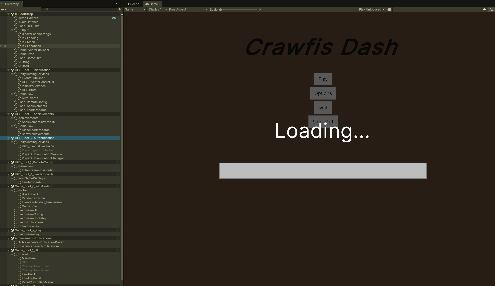
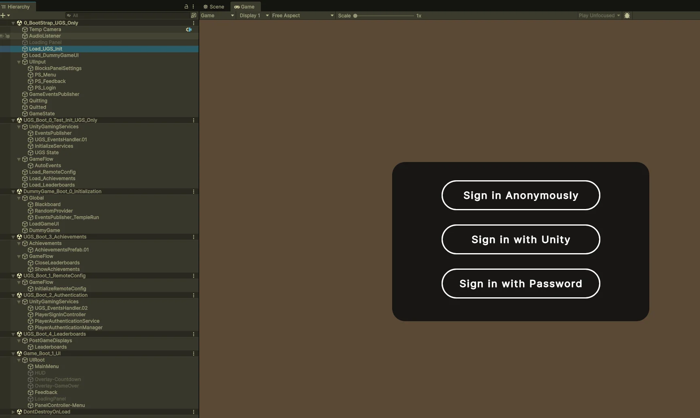
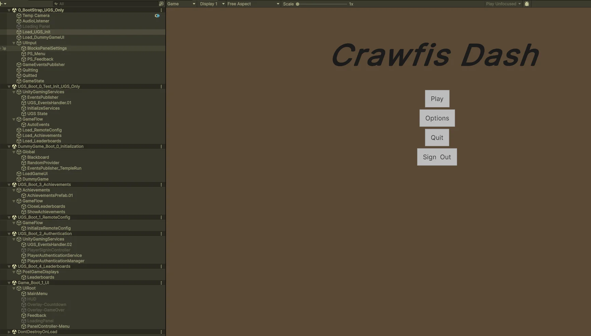
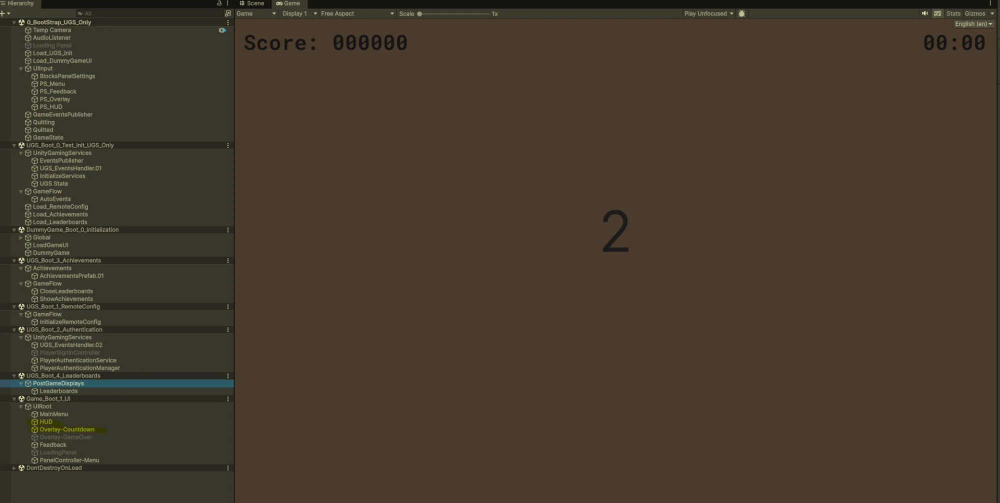
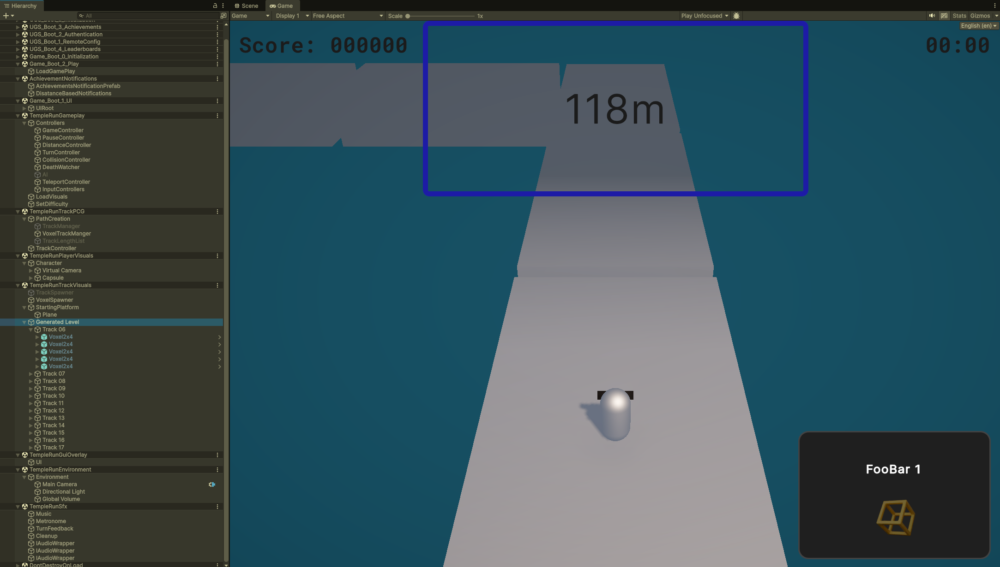
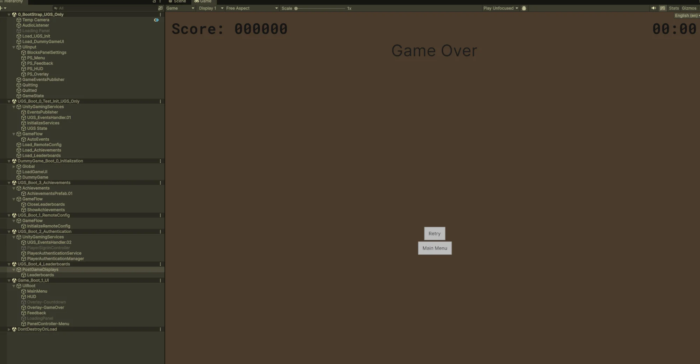
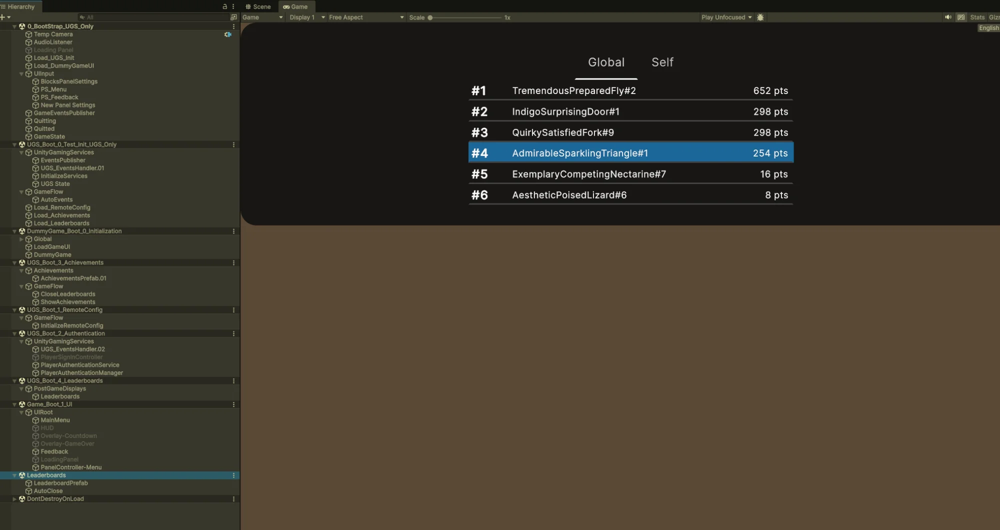
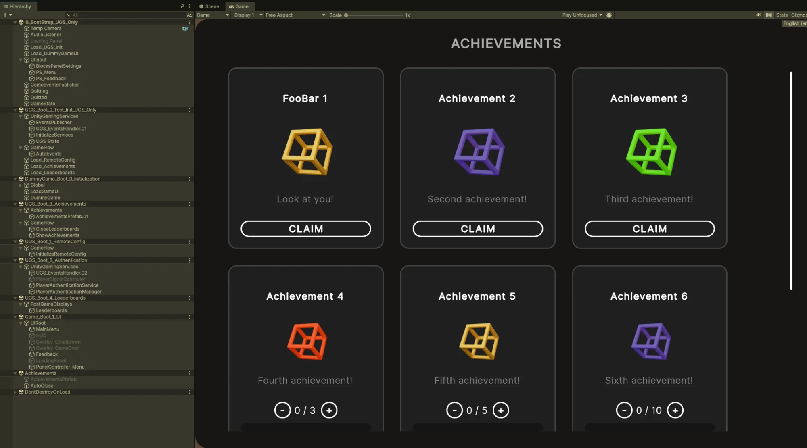

# Endless Runner with Unity Gaming Services (UGS)

A Unity project template demonstrating **event-driven architecture** for integrating Unity Gaming Services with gameplay systems while maintaining clean separation of concerns.

**Unity Version:** 6000.0.x+ (Unity 6)  
**License:** CC0-1.0 (Public Domain)

---

## Table of Contents

1. [Overview](#overview)
2. [Template Lineage](#template-lineage)
3. [Architecture](#architecture)
4. [Getting Started](#getting-started)
5. [Build Profiles](#build-profiles)
6. [Visual Walkthrough: Loading Panel (All Profiles)](#visual-walkthrough-loading-panel-all-profiles)
7. [Visual Walkthrough: Windows](#visual-walkthrough-windows)
8. [Visual Walkthrough: Test_UGS_Windows](#visual-walkthrough-test_ugs_windows)
9. [Visual Walkthrough: Test_GameOnly_Windows](#visual-walkthrough-test_gameonly_windows)
10. [Project Structure](#project-structure)
11. [Scene Architecture](#scene-architecture)
12. [Event System](#event-system)
13. [Unity Gaming Services Integration](#unity-gaming-services-integration)
14. [Dependencies](#dependencies)
15. [Development Tasks](#development-tasks)
16. [Design Principles](#design-principles)
17. [Extension Points](#extension-points)
18. [License](#license)

---

## Overview

This template is used in **CSE 5912: Game Design and Development Capstone** at The Ohio State University. It provides student teams with a working endless runner that demonstrates:

- **Decoupled event-driven communication** via the EventsPublisher package
- **UGS Building Blocks** (Authentication, Leaderboards, Achievements) wired through events
- **Additive scene loading** for modular game structure
- **Separation of gameplay logic from visuals/audio**
- **Multiple build profiles** for testing UGS and gameplay independently

The gameplay itself is a Temple Run-style endless runner where the core mechanic is a timed teleportation (not a true turn) that snaps the player to a new path segment when triggered within a valid distance window.

---

## Template Lineage

```
┌─────────────────────────────────────────────────────────────────────────┐
│                         TempleRun1-NoArt                                │
│   Programming-centric implementation with no graphics dependencies      │
│   - Event-based architecture (MVC pattern)                              │
│   - Distance model: total, segment, turn, death distances               │
│   - No physics/graphics required for core gameplay                      │
└─────────────────────────────────────────────────────────────────────────┘
                                    │
                                    ▼
┌─────────────────────────────────────────────────────────────────────────┐
│                       EndlessRunnerTemplate                             │
│   Adds visual/audio layers and additional scenes                        │
│   - 8 additive scenes (gameplay, visuals, SFX, environment)             │
│   - TrackManager with PCG track generation                              │
│   - UI Toolkit integration                                              │
│   - Audio Manager via GTMY.Audio package                                │
└─────────────────────────────────────────────────────────────────────────┘
                                    │
                                    ▼
┌─────────────────────────────────────────────────────────────────────────┐
│                    RunnerUGSTemplate (this repo)                        │
│   Integrates Unity Gaming Services                                      │
│   - Player Authentication (Anonymous, Unity, Password)                  │
│   - Leaderboards (Global / Self views)                                  │
│   - Achievements (Instant and Progressive)                              │
│   - Remote Config, Cloud Save, Cloud Code ready                         │
│   - Three build profiles for isolated testing                           │
└─────────────────────────────────────────────────────────────────────────┘
```

---

## Architecture

### High-Level Design

```
┌──────────────────────────────────────────────────────────────────────────┐
│                              BOOT LAYER                                  │
│  ┌─────────────────┐                                                     │
│  │  0_BootStrap    │ ─────► Loads UGS_Boot + Game_Boot additively        │
│  └─────────────────┘                                                     │
└──────────────────────────────────────────────────────────────────────────┘
                    │                                │
                    ▼                                ▼
┌────────────────────────────────┐  ┌────────────────────────────────────┐
│         UGS LAYER              │  │           GAME LAYER               │
│  ┌──────────────────────────┐  │  │  ┌──────────────────────────────┐  │
│  │ UGS_Boot_0_Initialization│  │  │  │ Game_Boot_0_Initialization   │  │
│  │ - UGS Services Init      │  │  │  │ - GameConfig loading         │  │
│  │ - Authentication Flow    │  │  │  │ - RandomProvider setup       │  │
│  │ - Event Publishing       │  │  │  │ - Scene orchestration        │  │
│  └──────────────────────────┘  │  │  └──────────────────────────────┘  │
│              │                 │  │              │                     │
│              ▼                 │  │              ▼                     │
│  ┌──────────────────────────┐  │  │  ┌──────────────────────────────┐  │
│  │ Building Blocks:         │  │  │  │ Gameplay Scenes:             │  │
│  │ - Authentication         │  │  │  │ - TempleRunGameplay          │  │
│  │ - Remote Config          │  │  │  │ - TempleRunTrackPCG          │  │
│  │ - Leaderboards           │  │  │  │ - TempleRunVisuals           │  │
│  │ - Achievements           │  │  │  │ - TempleRunGuiOverlay        │  │
│  └──────────────────────────┘  │  │  │ - TempleRunEnvironment       │  │
└────────────────────────────────┘  │  │ - TempleRunSfx               │  │
                                    │  └──────────────────────────────┘  │
                                    └────────────────────────────────────┘
                    │                                │
                    └────────────────┬───────────────┘
                                     ▼
                    ┌────────────────────────────────┐
                    │      EventsPublisher           │
                    │  (Central Event Bus)           │
                    │  - Decouples all systems       │
                    │  - Pub/Sub pattern             │
                    └────────────────────────────────┘
```

### Separation of Concerns

| Layer | Responsibility | Examples |
|-------|----------------|----------|
| **Model** | Distance tracking, game state | `DistanceController`, `TrackManager` |
| **View** | Visual/audio feedback | `TempleRunVisuals`, `TempleRunSfx` |
| **Controller** | Input handling, game flow | `InputController`, `TurnController` |
| **Services** | UGS integration | Authentication, Leaderboards, Achievements |

---

## Getting Started

### Prerequisites

- **Unity 6000.0.x** or later (Unity 6)
- **Unity Gaming Services Account** with project linked
- **Git LFS** (for binary assets)

### 1. Clone or Use as Template

```bash
# Option 1: Use GitHub's "Use this template" button (recommended)
# Option 2: Clone directly
git clone https://github.com/crawfis/RunnerUGSTemplate.git
```

### 2. Open in Unity

Open the project folder in Unity Hub. Allow time for package resolution.

### 3. Generate Cloud Code Bindings

```
Services → Cloud Code → Generate All Modules Bindings
```

Verify: Check `Assets/CloudCode/GeneratedModulesBindings` folder exists.

### 4. Configure Play Mode

**Important:** Set the system to always load scene 0 on Play:

```
CrawfisSoftware → Play Scene 0 Always (toggle ON)
```

> ⚠️ This setting does not persist between Unity sessions. Re-enable after restarting Unity.

### 5. Enable Event Logging (Optional)

```
CrawfisSoftware → Events → Event Logging Enabled
```

### 6. Link to Unity Gaming Services

1. Go to **Edit → Project Settings → Services**
2. Link to your UGS Organization and create a new Project
3. Create Environments: `production`, `development`, `initial-development`

### 7. Configure UGS Environment

1. Go to **Edit → Project Settings → Services → Environments**
2. Select `initial-development` for testing
3. Open scene `UGS_Boot_0_Initialization`
4. Select `InitializeServices` GameObject
5. Enable "Use Custom Environment" and set to `initial-development`

### 8. Deploy UGS Configuration

1. Open **Services → Deployment**
2. Select all configuration files (except AccessControl initially)
3. Right-click → **Deploy Selected**

> If Leaderboard shows "Access has been restricted" error, right-click `LeaderboardsAccessControl.ac` → Delete Remote

### 9. Run the Game

Open `Assets/Scenes/Boot/0_BootStrap` and enter Play Mode.

---

## Build Profiles

Three build profiles support isolated development and testing:

| Profile | Purpose | Scene 0 |
|---------|---------|---------|
| **Windows** | Full production build | `0_BootStrap` |
| **Test_UGS_Windows** | UGS testing without gameplay | `0_BootStrap_UGS_Only` |
| **Test_GameOnly_Windows** | Gameplay without UGS | `0_BootStrap` (UGS disabled) |

### Test_UGS_Windows Scene List

```
 0  Scenes/Boot/Test/0_BootStrap_UGS_Only          ◄── Entry point
 1  Scenes/Boot/Test/UGS_Boot_0_Test_Init_UGS_Only ◄── UGS init
 2  Scenes/Boot/Test/DummyGame_Boot_0_Initialization ◄── Dummy game
 3  Scenes/Boot/Game_Boot_0_Initialization
 4  Scenes/Boot/Game_Boot_1_UI
 5  Scenes/Boot/Game_Boot_2_Play
 6  Scenes/Boot/UGS_Boot_1_RemoteConfig
 7  Scenes/Boot/UGS_Boot_2_Authentication
 8  Scenes/Boot/UGS_Boot_3_Achievements
 9  Scenes/Boot/UGS_Boot_4_Leaderboards
10  Scenes/UGS/AchievementNotifications
11  Scenes/UGS/Achievements
12  Scenes/UGS/Leaderboards
```

### Switching Profiles

1. **File → Build Profiles**
2. Select desired profile
3. Click **Switch Profile** or **Build**

---

## Visual Walkthrough: Loading Panel (All Profiles)

All build profiles share a common loading panel that displays during scene initialization and async operations.



The loading panel displays:
- **Game Title** - "Crawfis Dash" (customizable in UI)
- **Menu Buttons** - Play, Options, Quit, Sign Out (visibility depends on game state)
- **Loading Indicator** - "Loading..." text with progress bar placeholder
- **Progress Bar** - Currently a visual placeholder; logic to show actual progress is TODO

**Hierarchy (0_BootStrap):** `UIInput` → `BlocksPanelSettings` → `PS_Loading`

> **Note:** The loading panel can be toggled on/off programmatically. Actual progress tracking requires additional implementation.

---

## Visual Walkthrough: Windows

The **Windows** profile is the full production build with UGS integration and actual Temple Run gameplay. This is the **ground truth** configuration; other profiles differ from this baseline.

### Windows Scene List

```
 0  Scenes/Boot/0_BootStrap                      ◄── Entry point
 1  Scenes/Boot/Game_Boot_0_Initialization       ◄── Game config, RandomProvider
 2  Scenes/Boot/Game_Boot_1_UI                   ◄── Main Menu, HUD, Overlays
 3  Scenes/Boot/Game_Boot_2_Play                 ◄── Gameplay scene loader
 4  Scenes/Boot/UGS_Boot_0_Initialization        ◄── UGS services init
 5  Scenes/Boot/UGS_Boot_1_RemoteConfig          ◄── Remote Config
 6  Scenes/Boot/UGS_Boot_2_Authentication        ◄── Player sign-in
 7  Scenes/Boot/UGS_Boot_3_Achievements          ◄── Achievements system
 8  Scenes/Boot/UGS_Boot_4_Leaderboards          ◄── Leaderboards system
 9  Scenes/UGS/AchievementNotifications          ◄── In-game achievement toasts
10  Scenes/UGS/Achievements                      ◄── Achievements UI panel
11  Scenes/UGS/Leaderboards                      ◄── Leaderboards UI panel
12  Scenes/Game/TempleRunGameplay                ◄── Core gameplay model
13  Scenes/Game/TempleRunTrackPCG                ◄── Procedural track generation
14  Scenes/Game/TempleRunVisuals                 ◄── Visual representation
15  Scenes/Game/TempleRunGuiOverlay              ◄── Gameplay HUD
16  Scenes/Game/TempleRunEnvironment             ◄── Skybox, lighting
17  Scenes/Game/TempleRunSfx                     ◄── Sound effects
```

---

### Step 1: Loading

On launch, the loading panel appears while UGS services initialize and scenes load additively.

**Hierarchy:** See [Loading Panel (All Profiles)](#visual-walkthrough-loading-panel-all-profiles)

---

### Step 2: Authentication



After UGS initialization completes, the player sees three sign-in options:
- **Sign in Anonymously** - Creates a temporary account with auto-generated name
- **Sign in with Unity** - Uses Unity Player Account (Google, Apple, email)
- **Sign in with Password** - Developer-managed credentials

**Hierarchy:** `UGS_Boot_2_Authentication` scene active with:
- `PlayerSignInController` - UI interaction handling
- `PlayerAuthenticationService` - UGS authentication wrapper
- `PlayerAuthenticationManager` - State management

---

### Step 3: Main Menu



After successful authentication:
- **Play** - Start the endless runner gameplay
- **Options** - Settings panel (placeholder)
- **Quit** - Exit application
- **Sign Out** - Return to authentication

**Hierarchy:** `Game_Boot_1_UI` scene with `MainMenu` active under `UIRoot`

---

### Step 4: Countdown



Clicking Play triggers:
- Gameplay scenes load additively (TempleRunGameplay, TrackPCG, Visuals, etc.)
- HUD appears: `Score: 000000` and timer `00:00`
- Countdown overlay: 3... 2... 1...

**Hierarchy:** `Overlay-Countdown` active, `HUD` visible, TempleRun* scenes loading

---

### Step 5: Gameplay



Active gameplay with Temple Run mechanics:
- **Track Generation** - Procedurally generated path segments
- **Player Movement** - Automatic forward motion
- **Turn Mechanics** - Timed teleportation to new path segments
- **Distance Tracking** - Score based on total distance traveled
- **Lives System** - Configurable number of lives (default: 2)

**Controls:**
| Input | Action |
|-------|--------|
| Arrow keys / WASD | Turn left/right |
| Swipe (touch) | Turn left/right |
| Tab | Pause/Resume toggle |
| Esc | End gameplay |

**Hierarchy:** All TempleRun* scenes active:
- `TempleRunGameplay` - `DistanceController`, `TurnController`
- `TempleRunTrackPCG` - `TrackManager`, path segments
- `TempleRunVisuals` - Player visual, track visuals
- `TempleRunGuiOverlay` - HUD, score, timer
- `TempleRunEnvironment` - Skybox, lighting
- `TempleRunSfx` - Audio sources

---

### Step 6: Player Failure

When the player fails (collision, missed turn, falls):
- `PlayerFailed` event fires
- Life count decremented
- If lives remain: brief recovery, continue
- If no lives: `PlayerDied` event fires

**Events:**
```
PlayerFailed → PlayerFailed.Handler → Check Lives
                                      ├── Lives > 0: Continue
                                      └── Lives = 0: PlayerDied
```

---

### Step 7: Game Over



When all lives are exhausted:
- Final score calculated from total distance
- Score submitted to leaderboard (via UGS)
- Game Over panel displayed

**Buttons:**
- **Retry** - Restart gameplay with reset score
- **Main Menu** - Return to main menu

**Hierarchy:** `Overlay-GameOver` active, gameplay scenes unloading

---

### Step 8: Leaderboard



The Leaderboard automatically appears showing:
- **Global** tab - Top rankings across all players
- **Self** tab - Player's rank with nearby scores
- Current player highlighted

**Configuration:**
- Sorted highest to lowest
- Best score strategy (not cumulative)
- Auto-closes after configurable timeout

**Hierarchy:** `Leaderboards` scene loaded with `LeaderboardPrefab`

---

### Step 9: Achievements



The Achievements panel displays earned and available achievements:

**Instant Achievements:**
- `CLAIM` button available immediately
- `ProgressTarget: 0` in config

**Progressive Achievements:**
- Progress bar showing `current / target`
- Unlocks when target reached

**Hierarchy:** `Achievements` scene loaded with `AchievementsPrefab`

---

### Step 10: Return to Main Menu

After achievements auto-close (or manual close), returns to Main Menu. 
- **Play** to start a new game
- **Sign Out** returns to authentication (Step 2)

### Complete Flow Diagram (Windows)

```
┌─────────────────┐
│    Loading      │
│   (UGS Init)    │
└────────┬────────┘
         │
         ▼
┌─────────────────┐
│ Authentication  │ ◄─────────────────────────────────┐
│ (3 sign-in      │                                   │
│  options)       │                                   │
└────────┬────────┘                                   │
         │ Sign In                                    │
         ▼                                            │
┌─────────────────┐                                   │
│   Main Menu     │ ◄──────────────────────┐          │
│ Play | Options  │                        │          │
│ Quit | Sign Out │────────────────────────┼──────────┘
└────────┬────────┘                        │
         │ Play                            │
         ▼                                 │
┌─────────────────┐                        │
│   Countdown     │                        │
│   3... 2... 1   │                        │
└────────┬────────┘                        │
         │                                 │
         ▼                                 │
┌─────────────────┐                        │
│    Gameplay     │◄───────┐               │
│  (Temple Run)   │        │               │
└────────┬────────┘        │               │
         │ PlayerFailed    │               │
         ▼                 │               │
    ┌─────────┐           │               │
    │ Lives?  │───Yes─────┘               │
    └────┬────┘                           │
         │ No                              │
         ▼                                 │
┌─────────────────┐                        │
│   Game Over     │                        │
│ Retry|Main Menu │───Retry───────────────►│
└────────┬────────┘        (restart)       │
         │ auto                            │
         ▼                                 │
┌─────────────────┐                        │
│  Leaderboard    │                        │
│ Global | Self   │                        │
└────────┬────────┘                        │
         │ auto-close                      │
         ▼                                 │
┌─────────────────┐                        │
│  Achievements   │                        │
│ Claim|Progress  │                        │
└────────┬────────┘                        │
         │ auto-close                      │
         └─────────────────────────────────┘
```

---

## Visual Walkthrough: Test_UGS_Windows

The **Test_UGS_Windows** profile bypasses actual gameplay to focus on UGS integration testing. It generates a random score and submits it to the leaderboard, allowing rapid testing of authentication, leaderboards, and achievements.

### Differences from Windows Profile

| Aspect | Windows | Test_UGS_Windows |
|--------|---------|------------------|
| Gameplay | Full Temple Run | **DummyGame** (instant random score) |
| Entry Scene | `0_BootStrap` | `0_BootStrap_UGS_Only` |
| Game Scenes | TempleRun* loaded | **Not loaded** |
| Retry/Main Menu | Functional | Placeholder (not wired) |
| Use Case | Production | UGS integration testing |

### Test_UGS_Windows Scene List

```
 0  Scenes/Boot/Test/0_BootStrap_UGS_Only          ◄── Entry point
 1  Scenes/Boot/Test/UGS_Boot_0_Test_Init_UGS_Only ◄── UGS init
 2  Scenes/Boot/Test/DummyGame_Boot_0_Initialization ◄── Dummy game
 3  Scenes/Boot/Game_Boot_0_Initialization
 4  Scenes/Boot/Game_Boot_1_UI
 5  Scenes/Boot/Game_Boot_2_Play
 6  Scenes/Boot/UGS_Boot_1_RemoteConfig
 7  Scenes/Boot/UGS_Boot_2_Authentication
 8  Scenes/Boot/UGS_Boot_3_Achievements
 9  Scenes/Boot/UGS_Boot_4_Leaderboards
10  Scenes/UGS/AchievementNotifications
11  Scenes/UGS/Achievements
12  Scenes/UGS/Leaderboards
```

---

### Step 1: Authentication


On launch, the player sees three sign-in options:
- **Sign in Anonymously** - Creates a temporary account with auto-generated name
- **Sign in with Unity** - Uses Unity Player Account (Google, Apple, email)
- **Sign in with Password** - Developer-managed credentials

**Hierarchy:** `UGS_Boot_2_Authentication` scene active with `PlayerSignInController`, `PlayerAuthenticationService`, `PlayerAuthenticationManager`

---

### Step 2: Main Menu


After successful authentication:
- **Play** - Start the game/test
- **Options** - Settings (placeholder)
- **Quit** - Exit application
- **Sign Out** - Return to authentication

**Hierarchy:** `Game_Boot_1_UI` scene with `MainMenu` active under `UIRoot`

---

### Step 3: Countdown


Clicking Play triggers:
- HUD appears: `Score: 000000` and timer `00:00`
- Countdown overlay: 3... 2... 1...

**Hierarchy:** `Overlay-Countdown` active, `HUD` visible

---

### Step 4: Game Over


In Test_UGS_Windows, the "DummyGame" immediately:
- Generates a random score
- Fires `PlayerDied` event
- Shows Game Over panel

Buttons are placeholders in this test profile:
- **Retry** - Not functional
- **Main Menu** - Not functional

**Hierarchy:** `Overlay-GameOver` active

---

### Step 5: Leaderboard


The Leaderboard automatically appears showing:
- **Global** tab - Top rankings across all players
- **Self** tab - Player's rank with nearby scores
- Current player highlighted (e.g., "AdmirableSparklingTriangle#1")
- Auto-generated anonymous names from Unity Authentication

**Features:**
- Sorted highest to lowest
- Best score strategy (not cumulative)
- Auto-closes after timeout

**Hierarchy:** `Leaderboards` scene loaded with `LeaderboardPrefab`, `AutoClose`

---

### Step 6: Achievements


The Achievements panel displays:

**Instant Achievements (Top Row):**
- FooBar 1, Achievement 2, Achievement 3
- `CLAIM` button (no progress required)
- `ProgressTarget: 0` in config

**Progressive Achievements (Bottom Row):**
- Achievement 4: `0 / 3`
- Achievement 5: `0 / 5`
- Achievement 6: `0 / 10`
- `+` / `-` buttons for manual testing

**Hierarchy:** `Achievements` scene loaded with `AchievementsPrefab`

---

### Step 7: Return to Main Menu

After achievements auto-close, returns to Main Menu. **Sign Out** returns to Step 1.

### Complete Flow Diagram

```
┌─────────────────┐
│ Authentication  │ ◄─────────────────────────────────┐
│ (3 sign-in      │                                   │
│  options)       │                                   │
└────────┬────────┘                                   │
         │ Sign In                                    │
         ▼                                            │
┌─────────────────┐                                   │
│   Main Menu     │ ◄──────────────────────┐          │
│ Play | Options  │                        │          │
│ Quit | Sign Out │────────────────────────┼──────────┘
└────────┬────────┘                        │
         │ Play                            │
         ▼                                 │
┌─────────────────┐                        │
│   Countdown     │                        │
│   3... 2... 1   │                        │
└────────┬────────┘                        │
         │                                 │
         ▼                                 │
┌─────────────────┐                        │
│   DummyGame     │                        │
│ (random score)  │                        │
└────────┬────────┘                        │
         │ PlayerDied                      │
         ▼                                 │
┌─────────────────┐                        │
│   Game Over     │                        │
│ Retry|Main Menu │                        │
└────────┬────────┘                        │
         │ auto                            │
         ▼                                 │
┌─────────────────┐                        │
│  Leaderboard    │                        │
│ Global | Self   │                        │
└────────┬────────┘                        │
         │ auto-close                      │
         ▼                                 │
┌─────────────────┐                        │
│  Achievements   │                        │
│ Claim|Progress  │                        │
└────────┬────────┘                        │
         │ auto-close                      │
         └─────────────────────────────────┘
```

---

## Visual Walkthrough: Test_GameOnly_Windows

The **Test_GameOnly_Windows** profile runs actual Temple Run gameplay **without** Unity Gaming Services. Use this for testing game mechanics, track generation, and UI flow independently of cloud services.

### Differences from Windows Profile

| Aspect | Windows | Test_GameOnly_Windows |
|--------|---------|----------------------|
| UGS Services | Enabled | **Disabled** |
| Authentication | Required | Skipped |
| Leaderboards | Submits scores | **Not available** |
| Achievements | Tracked | **Not available** |
| Entry Scene | `0_BootStrap` | `0_BootStrap` (UGS disabled) |
| Sign Out Button | Functional | Hidden/Disabled |

### Setup

1. Select **Test_GameOnly_Windows** build profile (File → Build Profiles)
2. Open `Assets/Scenes/Boot/0_BootStrap` scene
3. **Disable** the `Load_UGS_Init` GameObject in the hierarchy
4. Enable event logging (optional): `CrawfisSoftware → Events → Log Events`
5. Enter Play Mode

### Scene List

```
 0  Scenes/Boot/0_BootStrap                      ◄── Entry point
 1  Scenes/Boot/Game_Boot_0_Initialization       ◄── Game config, RandomProvider
 2  Scenes/Boot/Game_Boot_1_UI                   ◄── Main Menu, HUD, Overlays
 3  Scenes/Boot/Game_Boot_2_Play                 ◄── Gameplay scene loader
 4  Scenes/Game/TempleRunGameplay                ◄── Core gameplay model
 5  Scenes/Game/TempleRunTrackPCG                ◄── Procedural track generation
 6  Scenes/Game/TempleRunVisuals                 ◄── Visual representation
 7  Scenes/Game/TempleRunGuiOverlay              ◄── Gameplay HUD
 8  Scenes/Game/TempleRunEnvironment             ◄── Skybox, lighting
 9  Scenes/Game/TempleRunSfx                     ◄── Sound effects
```

> **Note:** UGS scenes (4-11 from Windows profile) are not loaded.

---

### Step 1: Loading

Same as [Loading Panel (All Profiles)](#visual-walkthrough-loading-panel-all-profiles). UGS initialization is skipped, so loading is faster.

---

### Step 2: Main Menu (No Authentication)


Authentication is bypassed entirely:
- **Play** - Start gameplay immediately
- **Options** - Settings (placeholder)
- **Quit** - Exit application
- **Sign Out** - Hidden or disabled

**Hierarchy:** `Game_Boot_1_UI` scene with `MainMenu` active. No UGS scenes loaded.

---

### Step 3: Countdown → Gameplay

Same flow as [Windows Steps 4-6](#step-4-countdown) but without UGS event handlers:
- Countdown: 3... 2... 1...
- Gameplay starts with full Temple Run mechanics
- Score tracked locally only

---

### Step 4: Game Over (No Leaderboard)


When all lives exhausted:
- Final score displayed
- **No leaderboard submission** (UGS disabled)
- **No achievements** panel appears

**Buttons:**
- **Retry** - Restart gameplay
- **Main Menu** - Return to main menu

---

### Step 5: Return to Main Menu

After Game Over, player can:
- **Retry** - Play again immediately
- **Main Menu** - Return to menu
- **Quit** from menu exits the game

### Complete Flow Diagram (Test_GameOnly_Windows)

```
┌─────────────────┐
│    Loading      │
│   (No UGS)      │
└────────┬────────┘
         │
         ▼
┌─────────────────┐
│   Main Menu     │ ◄──────────────────────┐
│ Play | Options  │                        │
│ Quit            │                        │
└────────┬────────┘                        │
         │ Play                            │
         ▼                                 │
┌─────────────────┐                        │
│   Countdown     │                        │
│   3... 2... 1   │                        │
└────────┬────────┘                        │
         │                                 │
         ▼                                 │
┌─────────────────┐                        │
│    Gameplay     │◄───────┐               │
│  (Temple Run)   │        │               │
└────────┬────────┘        │               │
         │ PlayerFailed    │               │
         ▼                 │               │
    ┌─────────┐           │               │
    │ Lives?  │───Yes─────┘               │
    └────┬────┘                           │
         │ No                              │
         ▼                                 │
┌─────────────────┐                        │
│   Game Over     │                        │
│ Retry|Main Menu │────────────────────────┘
└─────────────────┘
   (No Leaderboard)
   (No Achievements)
```

### Use Cases

- **Gameplay Testing** - Test turn mechanics, collision, track generation
- **UI/UX Testing** - Validate menu flow, HUD, overlays
- **Performance Profiling** - Isolate gameplay performance without network calls
- **Offline Development** - Work without internet connection
- **Event System Debugging** - Enable event logging to trace game flow

---

## Project Structure

```
RunnerUGSTemplate/
├── Assets/
│   ├── Blocks/                     # Unity Building Blocks
│   │   ├── Achievements/           # Achievement definitions, prefabs, scripts
│   │   ├── Common/                 # Shared UGS utilities
│   │   ├── Leaderboards/           # Leaderboard config, clients, UI
│   │   └── PlayerAccount/          # Authentication UI and logic
│   │
│   ├── Scenes/
│   │   ├── Boot/
│   │   │   ├── 0_BootStrap                    # Production entry
│   │   │   ├── Test/
│   │   │   │   ├── 0_BootStrap_UGS_Only       # UGS test entry
│   │   │   │   ├── UGS_Boot_0_Test_Init_UGS_Only
│   │   │   │   └── DummyGame_Boot_0_Initialization
│   │   │   ├── Game_Boot_0_Initialization
│   │   │   ├── Game_Boot_1_UI
│   │   │   ├── Game_Boot_2_Play
│   │   │   ├── UGS_Boot_1_RemoteConfig
│   │   │   ├── UGS_Boot_2_Authentication
│   │   │   ├── UGS_Boot_3_Achievements
│   │   │   └── UGS_Boot_4_Leaderboards
│   │   ├── UGS/
│   │   │   ├── Achievements
│   │   │   ├── AchievementNotifications
│   │   │   └── Leaderboards
│   │   └── Game/                   # Gameplay scenes (TempleRun*)
│   │
│   ├── Scripts/
│   │   ├── Controllers/            # Game flow controllers
│   │   ├── Events/                 # Event definitions (KnownEvents)
│   │   └── UGS/                    # UGS event adapters
│   │
│   ├── CloudCode/
│   │   └── GeneratedModulesBindings/
│   │
│   └── UI/                         # UI Toolkit assets (UXML, USS)
│
├── Packages/
│   └── manifest.json
│
└── ProjectSettings/
```

---

## Scene Architecture

### 0_BootStrap_UGS_Only Hierarchy

```
0_BootStrap_UGS_Only
├── Temp Camera                    # Android workaround
├── AudioListener
├── Loading Panel
├── Load_UGS_Init                  # Triggers UGS scene loading
├── Load_DummyGameUI
├── UIInput
│   ├── BlocksPanelSettings
│   ├── PS_Menu
│   ├── PS_Feedback
│   └── PS_HUD
├── GameEventsPublisher
├── Quitting / Quitted
└── GameState

UGS_Boot_0_Test_Init_UGS_Only
├── UnityGamingServices
│   ├── EventsPublisher
│   ├── UGS_EventsHandler.01
│   ├── InitializeServices
│   └── UGS State
└── GameFlow
    ├── AutoEvents
    ├── Load_RemoteConfig
    ├── Load_Achievements
    └── Load_Leaderboards

DummyGame_Boot_0_Initialization
├── Global
│   ├── Blackboard
│   ├── RandomProvider
│   └── EventsPublisher_TempleRun
├── LoadGameUI
└── DummyGame

UGS_Boot_1_RemoteConfig
└── GameFlow
    └── InitializeRemoteConfig

UGS_Boot_2_Authentication
├── UnityGamingServices
│   ├── UGS_EventsHandler.02
│   ├── PlayerSignInController
│   ├── PlayerAuthenticationService
│   └── PlayerAuthenticationManager

UGS_Boot_3_Achievements
├── Achievements
│   └── AchievementsPrefab.01
└── GameFlow
    ├── CloseLeaderboards
    └── ShowAchievements

UGS_Boot_4_Leaderboards
└── PostGameDisplays
    └── Leaderboards

Game_Boot_1_UI
└── UIRoot
    ├── MainMenu
    ├── HUD
    ├── Overlay-Countdown
    ├── Overlay-GameOver
    ├── Feedback
    ├── LoadingPanel
    └── PanelController-Menu
```

---

## Event System

The [`CrawfisSoftware.EventsPublisher`](https://github.com/crawfis/EventsPublisher) package provides a decoupled pub/sub event system.

### Viewing Events

Open the Events window: `CrawfisSoftware → Events → Event Publisher Menu`

During play, you can:
- See all events as they fire
- Select an event and click "Publish Event" to manually trigger it
- Test game flow without playing (e.g., trigger `PlayerDied` from menu)

### Core Gameplay Events

| Event | Publisher | Subscribers |
|-------|-----------|-------------|
| `GameStarting` | GameController | Multiple systems |
| `GameStarted` | GameController | DeathWatcher, DistanceController, TrackManager |
| `GameOver` | GameController | DeathWatcher, DistanceController |
| `Pause` | PauseController | GameController |
| `Resume` | PauseController | GameController |
| `Quitting` | QuitController | All systems (cleanup) |
| `Quitted` | QuitController | Application exit |
| `ActiveTrackChanged` | TrackManager | DeathWatcher, GUIController, TurnController |
| `LeftTurnRequested` | InputController | TurnController |
| `RightTurnRequested` | InputController | TurnController |
| `LeftTurnSucceeded` | TurnController | TrackManager |
| `RightTurnSucceeded` | TurnController | TrackManager |
| `PlayerFailed` | TurnController | DistanceController, PlayerLifeController |
| `PlayerDied` | PlayerLifeController | GameController |

### UGS Events

| Event | Description |
|-------|-------------|
| `PlayerSignedIn` | Authentication completed successfully |
| `LeaderboardScoreSubmitted` | Score posted to leaderboard |
| `AchievementUnlocked` | Achievement completed |

---

## Unity Gaming Services Integration

### Building Blocks Included

| Block | Purpose |
|-------|---------|
| **Player Account** | Authentication UI, anonymous/platform sign-in |
| **Leaderboards** | Score submission, Global/Self ranking views |
| **Achievements** | Progress tracking, claim notifications |
| **Remote Config** | Server-side configuration |

### Authentication Options

1. **Anonymous** - Auto-generated player name (e.g., "AdmirableSparklingTriangle#1")
2. **Unity Player Account** - Google, Apple, or email sign-in (Unity-managed)
3. **Username/Password** - Developer-managed credentials

### Leaderboard Configuration

Default leaderboard (`DailyDistance`):
- Sorting: Highest to lowest
- Strategy: Best Score
- Buckets: 200 players per bucket
- Reset: Daily at midnight (recurring)

### Achievement Configuration

Achievements are defined in `Assets/Blocks/Achievements/Deployment/Achievements.ach`:

```json
[{
  "Id": "first_achievement",
  "Icon": "thumbnail",
  "Title": "FooBar 1",
  "Description": "Look at you!",
  "IsHidden": false,
  "ProgressTarget": 0
}, {
  "Id": "second_achievement",
  "Icon": "thumbnail_blue",
  "Title": "Achievement 2",
  "Description": "Second achievement!",
  "IsHidden": false,
  "ProgressTarget": 0
}]
```

- `ProgressTarget: 0` = Instant (claim immediately)
- `ProgressTarget: N` = Progressive (requires N completions)

### Deployment Files

| File Type | Extension | Purpose |
|-----------|-----------|---------|
| Leaderboard | `.lb` | Leaderboard rules |
| Achievement | `.ach` | Achievement definitions |
| Access Control | `.ac` | Security policies |
| Remote Config | `.rc` | Server-side values |

---

## Dependencies

### Unity Packages (Git URLs)

| Package | Repository | Purpose |
|---------|------------|---------|
| EventsPublisher | [crawfis/EventsPublisher](https://github.com/crawfis/EventsPublisher) | Pub/sub event system |
| RandomProvider | [crawfis/RandomProvider](https://github.com/crawfis/RandomProvider) | Seeded random, reproducibility |
| GTMY.Audio | [crawfis/GTMY.Audio](https://github.com/crawfis/GTMY.Audio) | Audio management with Addressables |

### UGS SDK Packages

- `com.unity.services.core`
- `com.unity.services.authentication`
- `com.unity.services.leaderboards`
- `com.unity.services.cloudsave`
- `com.unity.services.cloudcode`
- `com.unity.services.remoteconfig`

---

## Development Tasks

### Initial Setup

- [ ] **Update Player Settings**: Company, Product, Version (`0.1.0`)
- [ ] **Update Editor Settings**: Root namespace → `CompanyName.ProductName`
- [ ] **Link UGS Project**: Connect to Unity Gaming Services
- [ ] **Deploy UGS Config**: Deploy `.lb`, `.ach`, `.ac` files
- [ ] **Create Environments**: `production`, `development`, `initial-development`

### UI Tasks

- [ ] **Main Menu**: Customize title, add logo
- [ ] **Credits Screen**: Data-driven, track third-party assets
- [ ] **Game Over Panel**: Wire up Retry/Main Menu buttons
- [ ] **Settings Panel**: Audio, graphics options
- [ ] **Localization**: Set up string tables

### Gameplay Features

- [ ] **Obstacles**: Head/slide, foot/jump
- [ ] **Collectibles**: Coins, power-ups
- [ ] **Difficulty Progression**: Use Remote Config

### UGS Features

- [ ] **Multiple Leaderboards**: Daily, weekly, all-time
- [ ] **Achievement Logic**: Wire gameplay events to achievement progress
- [ ] **Cloud Save**: Player preferences, unlocks
- [ ] **Economy**: In-game currency (future)

---

## Design Principles

*From the TempleRun presentation and documentation:*

### Decouple Events from Actions

```csharp
// ❌ BAD: Tight coupling
void OnTriggerEnter(Collider col) {
    GameManager.Instance.PlayerDied();  // Direct reference
}

// ✅ GOOD: Event-driven
void OnTriggerEnter(Collider col) {
    EventsPublisher.Publish(KnownEvents.PlayerFailed);  // Decoupled
}
```

### Avoid "PlayerController" Anti-Pattern

> "Do not call a class PlayerController unless it is an empty shell that delegates all of its work."

Split responsibilities:
- `TurnController` - Handle turn requests
- `DistanceController` - Track distances
- `CollisionController` - Handle collisions

### Use Data Over If Statements

```csharp
// ❌ BAD: Hardcoded logic
if (direction == Direction.Left) { ... }
else if (direction == Direction.Right) { ... }

// ✅ GOOD: Data-driven
private static readonly Direction CrossSection = Direction.N | Direction.W | Direction.E;
```

### Separate Creation from Runtime

- Use interfaces for graph traversal (no `AddNode`, `RemoveNode`)
- Plan for Addressables and Object Pooling
- Avoid scripts that depend on specific art assets

### Implicit Coupling Awareness

Be aware of hidden dependencies:
- Speed assumptions in gameplay code
- Art asset size assumptions (`bounds.size`)
- Force designers to provide data you need

---

## Extension Points

### Adding New Events

1. Define in `KnownEvents.cs`:
```csharp
public static readonly string MyEvent = "MyEvent";
```

2. Publish:
```csharp
EventsPublisher.Publish(KnownEvents.MyEvent, payload);
```

3. Subscribe:
```csharp
EventsPublisher.Subscribe(KnownEvents.MyEvent, OnMyEvent);
```

### Adding New UGS Services

1. Install package via Package Manager
2. Create initialization in appropriate `UGS_Boot_*` scene
3. Create event adapters to bridge UGS callbacks to EventsPublisher
4. Add deployment configuration files

### Alternative Inputs

The architecture supports swapping input methods:
- Keyboard/Gamepad (current)
- Touch/Swipe
- Accelerometer
- Voice commands
- Assistive devices
- Motion capture

Modify `InputController` and adjust cooldown timers as needed.

---

## Testing Without UGS

To test gameplay without Unity Gaming Services:

1. Select the **Windows_Game_Only** build profile
2. Open `0_BootStrap` scene
3. Disable the `Load_UGS_Init` GameObject
4. Enable event logging: `CrawfisSoftware → Events → Log Events`
5. Play

Controls:
- **Arrow keys / WASD** or **Swipe** - Turn left/right
- **Tab** - Pause/Resume toggle
- **Esc** - End gameplay

Default difficulty: 2 lives (configurable in `GameConfig.cs`)

### Quit Behavior

Clicking Quit:
1. Fires `Quitting` event
2. Unloads all scenes except scene 0
3. Prints unsubscribed event handlers to Console
4. Fires `Quitted` event
5. Exits play mode (or quits in build)

---

## Additional Resources

- [Unity Gaming Services Documentation](https://docs.unity.com/ugs/)
- [Leaderboards Guide](https://docs.unity.com/ugs/manual/leaderboards/manual/leaderboards)
- [Achievements Building Block](https://docs.unity3d.com/6000.0/Documentation/Manual/building-blocks-liveops-achievements.html)
- [Event Publisher Package](https://github.com/crawfis/EventsPublisher)

---

## License

This project is licensed under **CC0-1.0** (Creative Commons Zero v1.0 Universal).

You can copy, modify, distribute, and perform the work, even for commercial purposes, all without asking permission.

---

## Acknowledgments

- **Roger Crawfis** - Original Temple Run programming framework, OSU CSE 5912
- **Unity Technologies** - Building Blocks and UGS SDKs
- **samyam** - YouTube tutorials that inspired the art-free approach
- **CSE 5912 Capstone Students** - Ongoing refinement and feedback
