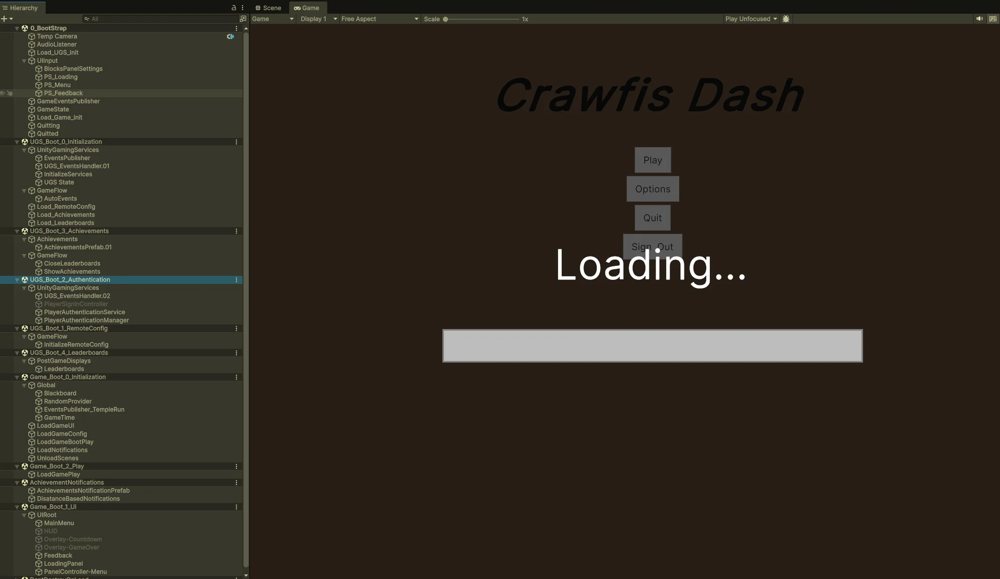
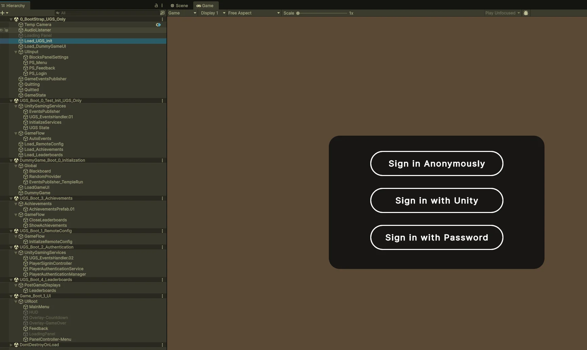
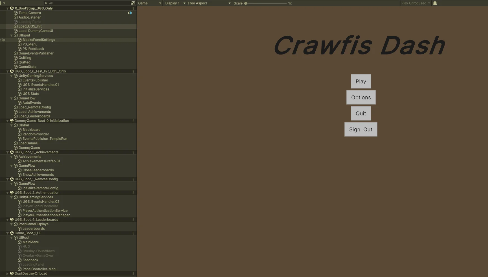
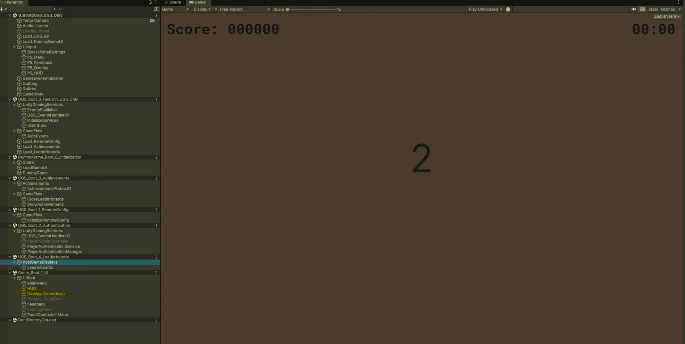
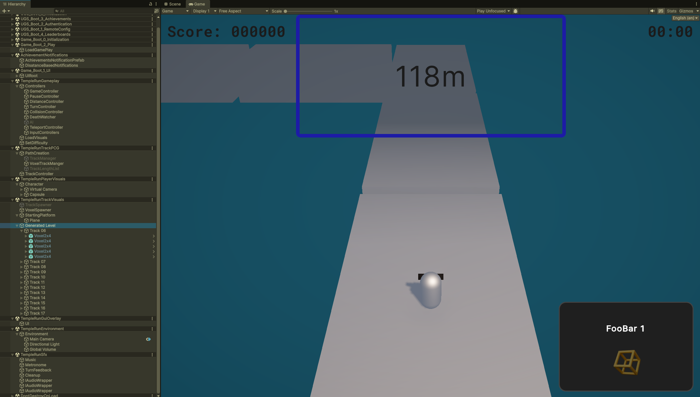
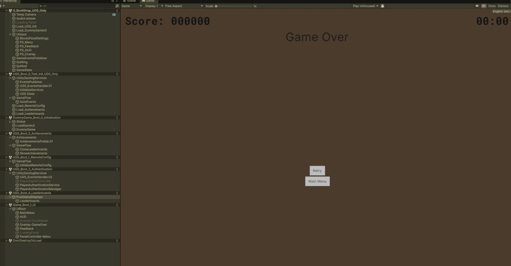
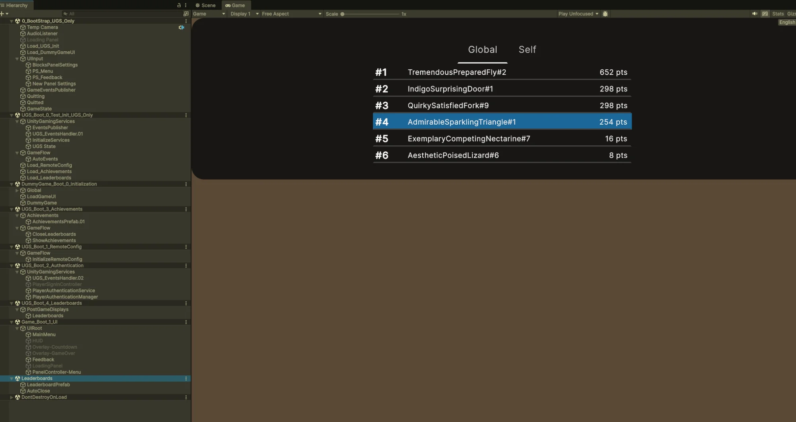
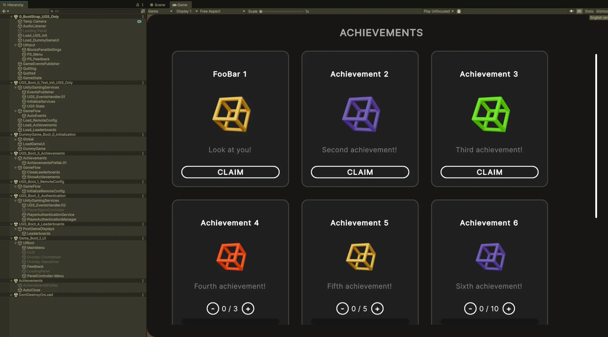

# Endless Runner with Unity Gaming Services (UGS)

A Unity project template demonstrating **event-driven architecture** for integrating Unity Gaming Services with gameplay systems while maintaining clean separation of concerns.

**Unity Version:** 6000.0.x+ (Unity 6)  
**License:** CC0-1.0 (Public Domain)

---

## Table of Contents

1. [Overview](#overview)
2. [Codebase Statistics](#codebase-statistics)
3. [Template Lineage](#template-lineage)
4. [Architecture](#architecture)
5. [Getting Started](#getting-started)
6. [Build Profiles](#build-profiles)
7. [Visual Walkthrough: Loading Panel (All Profiles)](#visual-walkthrough-loading-panel-all-profiles)
8. [Visual Walkthrough: Windows](#visual-walkthrough-windows)
9. [Visual Walkthrough: Test_UGS_Windows](#visual-walkthrough-test_ugs_windows)
10. [Visual Walkthrough: Test_GameOnly_Windows](#visual-walkthrough-test_gameonly_windows)
11. [Project Structure](#project-structure)
12. [Scene Architecture](#scene-architecture)
13. [Event System](#event-system)
14. [Unity Gaming Services Integration](#unity-gaming-services-integration)
15. [Dependencies](#dependencies)
16. [Development Tasks](#development-tasks)
17. [Design Principles](#design-principles)
18. [Extension Points](#extension-points)
19. [License](#license)

---

## Overview

This template is used in **CSE 5912: Game Design and Development Capstone** at The Ohio State University. Its primary purpose is to provide **the glue** — the event-driven wiring that connects gameplay mechanics, Unity Gaming Services, UI, audio, and visuals without any of those systems knowing about each other.

The gameplay itself (a Temple Run-style endless runner) is intentionally simple. The core mechanic is a timed teleportation that snaps the player to a new path segment when triggered within a valid distance window. The game exists to give the glue something meaningful to connect, not as a showcase of gameplay depth.

**What the template provides:**

- **Event buses** — five static typed buses (`GameFlow`, `TempleRun`, `UserInitiated`, `GameService`, `UGS`), each an `EventsFor<TEnum>` aliased per file, that any system can publish to or subscribe from without holding a reference to anything else
- **Bridge classes** — explicit cross-domain translators (`Input2TempleRunAutoEventBridge`, `TempleRunGameFlowBridge`, and — around the `GameServiceEvents` contract — `TempleRunUGSBridge`, `UGSGameFlowBridge`, `GameServiceEventsUGSBridge`) that are the *only* permitted places for one domain to react to another domain's events
- **Auto-event chains** — dictionary-driven progressions (`Requested → Starting → Started`) that fire automatically, eliminating boilerplate sequencing code while allowing for new hooks to be injected at key times / events.
- **Additive scene isolation** — each gameplay concern (obstacles, collectables, visuals, audio, HUD/countdown, track) lives in its own scene and communicates exclusively through events (preferred) or a shared Blackboard
- **Domain isolation enforcement** — rules and skills that prevent accidental coupling from creeping back in
- **Multiple build profiles** — swap the gameplay or UGS layers independently to test either in isolation

Student teams can replace the Temple Run gameplay with their own game, add new UGS services, or swap visual/audio layers — without modifying any existing code — because every boundary is an event.

---

## Codebase Statistics

> In-repo domain code only (`Assets/GameFlow`, `Assets/TempleRun`, `Assets/UGSGlue`) — excludes
> `ThirdParty/`, `CloudCode/`, generated bindings, and the UGS + Common + Contracts code, which
> now ships as UPM packages rather than as project source.

| Metric | Count |
|--------|-------|
| C# source files | 132 |
| Declared types (class / interface / enum / struct) | ~174 |
| Files defining MonoBehaviours | ~72 |
| Files defining ScriptableObjects | 14 |
| Namespaces | 21 |
| Unity scenes | 28 |
| Defined events (the 3 in-repo domains: GameFlow, TempleRun, UserInitiated) | 206 (76 + 121 + 9) |

The other two domains — `GameServiceEvents` and `UGS_EventsEnum` — are declared in packages and are
not counted above. **`CrawfisSoftware → Events → List Domains` is the authoritative count**: it
sweeps every `[EventEnum]` in edit mode and reports all five, so trust it over this table, which is
a hand-taken snapshot.

### Types by Domain

| Domain | Files | Primary responsibility |
|--------|-------|------------------------|
| `TempleRun` | 107 | Gameplay mechanics, player, track, power-ups, input, audio, editor tools |
| `GameFlow` | 22 | Boot, menus, level selection, scene management, UI panels |
| `UGSGlue` | 3 | This game's half of the `GameServiceEvents` contract |

The UGS domain (~40 files) and the shared Common/Contracts code now live in the
[EventDrivenUGS](https://github.com/crawfis/EventDrivenUGS) packages and are not counted here.

### Namespaces

In this repo:

```
CrawfisSoftware.Events (UserInitiatedEvents)   CrawfisSoftware.TempleRun
CrawfisSoftware.GameFlow                       CrawfisSoftware.TempleRun.Audio
CrawfisSoftware.GameFlow.Config                CrawfisSoftware.TempleRun.Editor
CrawfisSoftware.GameFlow.Events                CrawfisSoftware.TempleRun.Events
CrawfisSoftware.GameFlow.GameConfig            CrawfisSoftware.TempleRun.GameConfig
CrawfisSoftware.GameFlow.GameControl           CrawfisSoftware.TempleRun.Input
CrawfisSoftware.GameFlow.SceneManagement       CrawfisSoftware.TempleRun.PowerUps
CrawfisSoftware.GameFlow.UI                    CrawfisSoftware.TempleRun.Track
                                               CrawfisSoftware.TempleRun.Track.Geometry
CrawfisSoftware.UGS.Events (UGSGlue bridges)   CrawfisSoftware.TempleRun.UI
CrawfisSoftware.UGS.Leaderboard.Test (UGSGlue) CrawfisSoftware.Utility.Testing
```

From the packages: `CrawfisSoftware.Contracts` (contracts); `CrawfisSoftware.Events`,
`.Config`, `.SceneManagement`, `.Test`, `.Utility` (common); `CrawfisSoftware.UGS` and its
`.Events`, `.Authentication`, `.RemoteConfig`, `.Leaderboard`, `.Achievements`, `.Economy`,
`.UI`, `.GameConfig` children (ugs).

---

## Template Lineage

Each generation adds a new layer of **glue** — more systems, more boundaries to cross, more wiring needed.

```
┌─────────────────────────────────────────────────────────────────────────┐
│                         TempleRun1-NoArt   (out-dated)                  │
│   The core gameplay model — no art, no physics dependencies             │
│   - Event-based architecture (MVC pattern)                              │
│   - Distance model: total, segment, turn, death distances               │
│   - No physics/graphics required for core gameplay                      │
│                                                                         │
│   GLUE: TempleRunEvents on the static TempleRunBus wires input,         │
│         distance tracking, turn logic, and player lifecycle together    │
└─────────────────────────────────────────────────────────────────────────┘
                                    │
                                    ▼
┌─────────────────────────────────────────────────────────────────────────┐
│                       EndlessRunnerTemplate       (out-dated)           │
│   Adds visual/audio layers as separate additive scenes                  │
│   - Additive scenes: gameplay, visuals, SFX, environment, HUD           │
│   - TrackManager with PCG track generation                              │
│   - UI Toolkit integration                                              │
│   - Audio Manager via GTMY.Audio package                                │
│                                                                         │
│   GLUE: GameFlowEvents + GameFlowAutoEventFlow bridge the boot          │
│         sequence → menus → countdown → gameplay → game over flow;       │
│         TempleRunGameFlowBridge translates gameplay events (PlayerDied) │
│         into session lifecycle events (GameEnding)                      │
└─────────────────────────────────────────────────────────────────────────┘
                                    │
                                    ▼
┌─────────────────────────────────────────────────────────────────────────┐
│                    RunnerUGSTemplate (this repo)                        │
│   Integrates Unity Gaming Services as an independent domain             │
│   - Player Authentication (Anonymous, Unity, Password)                  │
│   - Leaderboards (Global / Self views)                                  │
│   - Achievements (Instant and Progressive)                              │
│   - Remote Config, Cloud Save, Cloud Code ready                         │
│   - Three build profiles for isolated layer testing                     │
│                                                                         │
│   GLUE: Assets/UGSGlue maps GameFlowEvents (GameEnding) onto the        │
│         GameServiceEvents contract (SessionEnding); the UGS package     │
│         maps that to UGS_EventsEnum (ScoreUpdating + CurrencySync-      │
│         Requested), so UGS never touches gameplay; UGSAutoEventFlow     │
│         chains init → auth → config → leaderboards → achievements       │
└─────────────────────────────────────────────────────────────────────────┘
```

---

## Architecture

### High-Level Design

```
┌───────────────────────────────────────────────────────────────────────────────────────────┐
│                              BOOT LAYER                                                   │
│  ┌───────────────────────────────────────┐                                                │
│  │  0_BootStrap                          │ ─────► Loads UGS_Boot + Game_Boot additively   │
│  │  - Game Flow Event Publishing         │                                                │
│  │  - User Initiated Event Publishing    │                                                │
│  └───────────────────────────────────────┘                                                │
└───────────────────────────────────────────────────────────────────────────────────────────┘
                    │                                │
                    ▼                                ▼
┌─────────────────────────────────┐  ┌───────────────────────────────────────┐
│         UGS LAYER               │  │           GAME LAYER                  │
│  ┌───────────────────────────┐  │  │  ┌─────────────────────────────────┐  │
│  │ UGS_Boot_0_Initialization │  │  │  │ Game_Boot_0_Initialization      │  │
│  │ - UGS Services Init       │  │  │  │ - GameConfig loading            │  │
│  │ - Authentication Flow     │  │  │  │ - RandomProvider setup          │  │
│  │ - UGS Event Publishing    │  │  │  │ - TempleRun Event Publishing    │  │
│  │ - UGS Scene orchestration │  │  │  │ - TempleRun Scene orchestration │  │
│  │                           │  │  │  │ - Blackboard                    │  │
│  └───────────────────────────┘  │  │  └─────────────────────────────────┘  │
│                │                │  │                 │                     │
│                ▼                │  │                 ▼                     │
│  ┌──────────────────────────┐   │  │  ┌──────────────────────────────┐     │
│  │ Building Blocks:         │   │  │  │ Gameplay Scenes:             │     │
│  │ - Authentication         │   │  │  │ - TempleRunGameplay          │     │
│  │ - Remote Config          │   │  │  │ - TempleRunTrackPCG          │     │
│  │ - Leaderboards           │   │  │  │ - TempleRunTrackVisuals      │     │
│  │ - Achievements           │   │  │  │ - TempleRunPlayerVisuals     │     │
│  └──────────────────────────┘   │  │  │ - TempleRunObstacles         │     │
└─────────────────────────────────┘  │  │ - TempleRunCollectables      │     │
                    │                │  │ - TempleRunGuiOverlay        │     │
                    │                │  │ - TempleRunEnvironment       │     │
                    │                │  │ - TempleRunSfx               │     │
                    │                │  └──────────────────────────────┘     │
                    │                └───────────────────────────────────────┘
                    │                                 │
                    └────────────────┬────────────────┘
                                     ▼
                    ┌────────────────────────────────┐
                    │      EventsPublisher           │
                    │  (Central Event Bus)           │
                    │  - Decouples all systems       │
                    │  - Pub/Sub pattern             │
                    └────────────────────────────────┘
```

### Separation of Concerns

| Layer | Responsibility | Examples |
|-------|----------------|----------|
| **Model** | Distance tracking, game state | `DistanceController`, `TrackManager` |
| **View** | Visual/audio feedback | `TempleRunPlayerVisuals`, `TempleRunTrackVisuals`, `TempleRunSfx` |
| **Controller** | Input handling, game flow | `InputController`, `TurnController` |
| **Services** | UGS integration | Authentication, Leaderboards, Achievements |

### How the Glue Works: A Complete Event Chain

This example traces what happens from the moment a player hits an obstacle to a score appearing on the leaderboard. No system along the chain holds a reference to any other — every handoff is an event.

```
[Player hits obstacle]
        │
        ▼  ObstacleCollisionDetector (TempleRun domain)
TempleRunBus.Publish(TempleRunEvents.ObstacleHit, ...)
        │
        ▼  PowerUpBuffController (TempleRun domain)
        Asks active power-up effects to absorb the hit (Shield)
        └─ not absorbed ──► PlayerFailingAtObstacle
        │
        ▼  TempleRunAutoEventFlow (same-domain auto-chain)
        PlayerFailingAtObstacle → PlayerFailing
        (PlayerFailedController later publishes PlayerFailed, ending the freeze)
        │
        ▼  PlayerLifeController (TempleRun domain)
        Decrements life count on PlayerFailing
        ├─ lives > 0 ──► brief recovery, run continues
        └─ lives = 0 ──► PlayerDied  (data: distance score — the payload
        │                rides every hop from here on)
        ▼  TempleRunAutoEventFlow (same-domain auto-chain)
        PlayerDied → TempleRunEndRequested → TempleRunEnding → TempleRunEnded
        │
        ▼  TempleRunGameFlowBridge (in GameFlow — bridge duty only)
        TempleRunEnded → GameFlowEvents.GameEnding
        │
        ▼  UGSGameFlowBridge (Assets/UGSGlue — bridge duty only)
        GameEnding → GameServiceEvents.SessionEnding   (the contract)
        │
        ▼  GameServiceEventsUGSBridge (UGS package — bridge duty only)
        SessionEnding → UGS_EventsEnum.ScoreUpdating
                      → UGS_EventsEnum.CurrencySyncRequested (banks the coins)
        │
        ▼  LeaderboardPlayerController (UGS package)
        Subscribes to UGS_EventsEnum.ScoreUpdating
        Calls the UGS Leaderboards SDK with the score payload
        Publishes UGS_EventsEnum.ScoreUpdated (or ScoreFailedToUpdate)
        │
        ▼  [GameEnded → SessionEnded → LeaderboardOpening: panel shown,
            achievements checked, ...]
```

**Key properties of this chain:**
- `ObstacleCollisionDetector` never imports anything from `GameFlow`, the contract, or `UGS`
- `LeaderboardPlayerController` never imports anything from `TempleRun` or `GameFlow` — the UGS package cannot even see those assemblies
- The bridge classes are the *only* files that cross domain boundaries — and they contain no gameplay or service logic, only translation
- The game and UGS never name each other's events: they meet at `GameServiceEvents`, a contract enum in its own package that neither side owns
- Replacing UGS with a different backend means re-implementing the service side of `GameServiceEvents` — no game file changes
- Replacing Temple Run with a different game means rewriting the small tables in `Assets/UGSGlue/` — no service file changes

---

## Getting Started

Looking for a full click-by-click setup of Unity Gaming Services for this template? See the walkthrough in [`docs/ConfigureUnityGamingServicesand-RunnerUGSTemplate.md`](docs/ConfigureUnityGamingServicesand-RunnerUGSTemplate.md).

### Prerequisites

- **Unity 6000.0.x** or later (Unity 6)
- **Unity Gaming Services Account** with project linked
- **Git LFS** (for binary assets)

### 1. Clone or Use as Template

```bash
# Option 1: Use GitHub's "Use this template" button (recommended)
# Option 2: Clone directly
git clone https://github.com/crawfis/RunnerUGSTemplate.git
```

### 2. Open in Unity

Open the project folder in Unity Hub. Allow time for package resolution.

### 3. Generate Cloud Code Bindings

```
Services → Cloud Code → Generate All Modules Bindings
```

Verify: Check `Assets/CloudCode/GeneratedModuleBindings` folder exists.

### 4. Configure Play Mode

**Important:** Set the system to always load scene 0 on Play:

```
CrawfisSoftware → Play Scene 0 Always (toggle ON)
```

> ⚠️ This setting may not persist between Unity sessions. Re-enable after restarting Unity.

### 5. Enable Event Logging (Optional)

```
CrawfisSoftware → Events → Log Events
```

### 6. Link to Unity Gaming Services

1. Go to **Edit → Project Settings → Services**
2. Link to your UGS Organization and create a new Project
3. Create Environments: `production`, `development`, `initial-development`

### 7. Configure UGS Environment

1. Go to **Edit → Project Settings → Services → Environments**
2. Select `initial-development` for testing
3. Open scene `UGS_Boot_0_Initialization`
4. Select `InitializeServices` GameObject
5. Enable "Use Custom Environment" and set to `initial-development`

### 8. Deploy UGS Configuration

1. Open **Services → Deployment**
2. Select all configuration files (except AccessControl initially)
3. Right-click → **Deploy Selected**

> If Leaderboard shows "Access has been restricted" error, right-click `LeaderboardsAccessControl.ac` → Delete Remote

### 9. Run the Game

Open `Assets/UGS/Scenes/Boot/0_BootStrap` (build index 0) and enter Play Mode.

---

## Build Profiles

Three build profiles support isolated development and testing:

| Profile | Purpose | Scene 0 |
|---------|---------|---------|
| **Windows** | Full production build | `0_BootStrap` |
| **Test_UGS_Windows** | UGS testing without gameplay | `0_BootStrap_UGS_Only` |
| **Test_GameOnly_Windows** | Gameplay without UGS | `0_BootStrap_Game_Only` |

### Test_UGS_Windows Scene List

```
 0  UGS/Scenes/Test/0_BootStrap_UGS_Only              ◄── Entry point
 1  UGS/Scenes/Boot/UGS_Boot_0_Initialization         ◄── UGS services init
 2  UGS/Scenes/Boot/UGS_Boot_1_RemoteConfig           ◄── Remote Config
 3  UGS/Scenes/Boot/UGS_Boot_2_Authentication         ◄── Player sign-in
 4  UGS/Scenes/Boot/UGS_Boot_3_Achievements           ◄── Achievements system
 5  UGS/Scenes/Boot/UGS_Boot_4_Leaderboards           ◄── Leaderboards system
 6  UGS/Scenes/Test/DummyGame_Boot_0_Initialization   ◄── Dummy game (random score)
 7  GameFlow/Scenes/Boot/Game_Boot_1_UI               ◄── Main Menu, Level Selection, Game Over
 8  UGS/Scenes/Test/Test_SubmitScoreAndEnd            ◄── Auto-submits score and ends game
 9  UGS/Scenes/UGS/AchievementNotifications           ◄── In-game achievement toasts
10  UGS/Scenes/UGS/Achievements                       ◄── Achievements UI panel
11  UGS/Scenes/UGS/Leaderboards                       ◄── Leaderboards UI panel
```

> The `.asset` file still carries a 13th entry, `UGS/Scenes/Test/UGS_Boot_0_Test_Init_UGS_Only`,
> pointing at a scene deleted in `cd09524`. **It has no effect and needs no action.** Unity drops an
> unresolvable path when it loads a profile, so the Build Profiles window shows twelve rows and
> builds use twelve scenes — the entry never reaches C# and cannot be selected or removed through
> the window. It is stale YAML that Unity has no reason to rewrite, and it will disappear on its own
> the next time the scene list is edited.

### Switching Profiles

1. **File → Build Profiles**
2. Select desired profile
3. Click **Switch Profile** or **Build**

---

## Visual Walkthrough: Loading Panel (All Profiles)

All build profiles share a common loading panel that displays during scene initialization and async operations.



The loading panel displays:
- **Game Title** - "Crawfis Dash" (customizable in UI)
- **Menu Buttons** - Play, Options, Quit, Sign Out (visibility depends on game state)
- **Loading Indicator** - "Loading..." text with progress bar placeholder
- **Progress Bar** - Currently a visual placeholder; logic to show actual progress is TODO

**Hierarchy:** `UIInput` in `0_BootStrap` hosts the UI Toolkit input/panel settings; the
loading and game-over overlays themselves live on `UIRoot/LoadingPanel` and
`UIRoot/Overlay-GameOver` in `Game_Boot_1_UI`, driven by `GameFlowUIPanelController`

> **Note:** The loading panel can be toggled on/off programmatically. Actual progress tracking requires additional implementation.

---

## Visual Walkthrough: Windows

The **Windows** profile is the full production build with UGS integration and actual Temple Run gameplay. This is the **ground truth** configuration; other profiles differ from this baseline.

### Windows Scene List

```
 0  UGS/Scenes/Boot/0_BootStrap                           ◄── Entry point
 1  UGS/Scenes/Boot/UGS_Boot_0_Initialization             ◄── UGS services init
 2  UGS/Scenes/Boot/UGS_Boot_1_RemoteConfig               ◄── Remote Config
 3  UGS/Scenes/Boot/UGS_Boot_2_Authentication             ◄── Player sign-in
 4  UGS/Scenes/Boot/UGS_Boot_3_Achievements               ◄── Achievements system
 5  UGS/Scenes/Boot/UGS_Boot_4_Leaderboards               ◄── Leaderboards system
 6  GameFlow/Scenes/Boot/Game_Boot_0_Initialization       ◄── Game config, RandomProvider
 7  GameFlow/Scenes/Boot/Game_Boot_1_UI                   ◄── Main Menu, Level Selection, Game Over
 8  GameFlow/Scenes/Boot/Game_Boot_2_Play                 ◄── Gameplay scene loader
 9  UGS/Scenes/UGS/AchievementNotifications               ◄── In-game achievement toasts
10  UGS/Scenes/UGS/Achievements                           ◄── Achievements UI panel
11  UGS/Scenes/UGS/Leaderboards                           ◄── Leaderboards UI panel
12  TempleRun/Scenes/Gameplay/TempleRunGameplay            ◄── Core gameplay logic (distance, lives)
13  TempleRun/Scenes/Gameplay/TempleRunTrackPCG            ◄── Procedural track generation
14  TempleRun/Scenes/Gameplay/TempleRunEnvironment         ◄── Skybox, lighting
15  TempleRun/Scenes/Gameplay/TempleRunGuiOverlay          ◄── Gameplay HUD and Countdown overlay
16  TempleRun/Scenes/Gameplay/TempleRunPlayerVisuals       ◄── Player visual representation
17  TempleRun/Scenes/Gameplay/TempleRunSfx                 ◄── Sound effects
18  TempleRun/Scenes/Gameplay/TempleRunTrackVisuals        ◄── Track visual meshes
19  TempleRun/Scenes/Gameplay/TempleRunCollectables        ◄── Coins and power-up spawning
20  TempleRun/Scenes/Gameplay/TempleRunObstacles           ◄── Obstacle spawning
```

---

### Step 1: Loading

On launch, the loading panel appears while UGS services initialize and scenes load additively.

**Hierarchy:** See [Loading Panel (All Profiles)](#visual-walkthrough-loading-panel-all-profiles)

---

### Step 2: Authentication



> **Screenshot is out of date.** This modal is an original implementation in the
> `com.crawfissoftware.ugs` package (`PlayerSignIn`), not the Building Blocks one, and its button
> labels are those listed below.

After UGS initialization completes, the player sees three sign-in options:
- **Play as Guest** - anonymous account with an auto-generated name
- **Unity Player Account** - Google, Apple or email, via Unity. Hidden automatically when that
  service is not configured, rather than offered and then failing
- **Username / Password** with **Sign In** and **Create Account** - developer-managed credentials

**Hierarchy:** `UGS_Boot_2_Authentication` scene active with:
- `PlayerSignInController` - UI interaction handling
- `PlayerAuthenticationService` - UGS authentication wrapper
- `PlayerAuthenticationManager` - State management

---

### Step 3: Main Menu



After successful authentication:
- **Play** - Start the endless runner gameplay
- **Options** - Settings panel (placeholder)
- **Quit** - Exit application
- **Sign Out** - Return to authentication

**Hierarchy:** `Game_Boot_1_UI` scene with `MainMenu` active under `UIRoot`

---

### Step 4: Level Selection

After clicking Play from the Main Menu, the Level Selection screen appears:
- Player selects a level (or difficulty configuration) from the `LevelSelector` panel
- `LevelSelectorPanelController` publishes `LevelSelected` carrying the chosen `LevelConfig`
- `LevelConfigApplier` publishes `GameConfigApplied` (the level's `DifficultyConfig`) and
  `LevelApplied` (the level number); `TempleRunGameFlowBridge` relays both into TempleRun,
  where they land on the `Blackboard`
- `DynamicLevelSceneLoader` loads the appropriate TempleRun gameplay scenes additively

**Hierarchy:** `LevelSelection` panel active under `UIRoot` in `Game_Boot_1_UI`

---

### Step 5: Countdown



Once the level scenes finish loading:
- HUD appears: `Score: 000000` and timer `00:00`
- Countdown overlay: 3... 2... 1...

Both the HUD and Countdown are part of the `TempleRunGuiOverlay` scene (TempleRun domain), managed by `CountdownController` and `CountdownUIController`.

**Hierarchy:** Countdown overlay and HUD active inside `TempleRunGuiOverlay`

---

### Step 6: Gameplay



Active gameplay with Temple Run mechanics:
- **Track Generation** - Procedurally generated path segments
- **Player Movement** - Automatic forward motion
- **Lane System** - Three-lane traversal with configurable lane width
- **Turn Mechanics** - Timed teleportation (snap) to new path segments
- **Obstacles** - Head-height and full-width barriers with lane-specific variants
- **Jump Mechanics** - Arc-based jumping to clear full-width obstacles
- **Slide Mechanics** - Event-driven slide with configurable cooldown
- **Dash Mechanics** - Speed boost with configurable parameters
- **Distance Tracking** - Score based on total distance traveled
- **Lives System** - Configurable number of lives (default: 2)
- **Player Animations** - Lean, jump, and slide animations linked to game events

The screenshot above shows a typical production run with all gameplay and UGS-related scenes loaded additively:

- `UGS_Boot_1_RemoteConfig`, `UGS_Boot_2_Authentication`, `UGS_Boot_3_Achievements`, `UGS_Boot_4_Leaderboards`
- `AchievementNotifications` and `Achievements` (for in-run notifications and post-run panel)
- Core Temple Run scenes: `TempleRunGameplay`, `TempleRunTrackPCG`, `TempleRunPlayerVisuals`, `TempleRunGuiOverlay`, `TempleRunEnvironment`, `TempleRunSfx`, `TempleRunTrackVisuals`, `TempleRunCollectables`, `TempleRunObstacles`

HUD elements visible in the image:
- **Score (top-left):** `Score: 000000` – total distance-based score
- **Run Distance (center):** e.g., `118m` – current run distance in meters
- **Run Timer (top-right):** `00:00` – elapsed run time
- **Toast Panel (bottom-right):** shows instant achievement notifications (e.g., **FooBar 1**) while the run continues

**Controls:**
| Input | Action |
|-------|--------|
| Arrow keys / WASD | Turn left/right (lane change) |
| Swipe (touch) | Turn left/right |
| Space | Jump |
| S | Slide |
| D | Dash |
| Tab | Pause/Resume toggle |
| Esc | End gameplay |

**Hierarchy:** All TempleRun* scenes active:
- `TempleRunGameplay` - `DistanceController`, `TurnController`, `PlayerLifeController`
- `TempleRunTrackPCG` - `TrackManager`, spline path segments
- `TempleRunTrackVisuals` - Track mesh generation (SimplePlane / Voxels)
- `TempleRunPlayerVisuals` - Player character visual and animations
- `TempleRunObstacles` - `ObstacleSpawner` (full-width and lane barriers)
- `TempleRunCollectables` - `CoinSpawner`, `PowerUpSpawner`
- `TempleRunGuiOverlay` - HUD (score, distance, timer) and Countdown overlay (`CountdownController`, `CountdownUIController`)
- `TempleRunEnvironment` - Skybox, lighting
- `TempleRunSfx` - Audio sources

---

### Step 7: Player Failure

When the player fails (collision or missed turn):
- `PlayerFailingAtObstacle` / `PlayerFailingAtTurn` fires and auto-chains to `PlayerFailing`
- `PlayerLifeController` decrements the life count
- `PlayerFailedController` publishes `PlayerFailed`, which ends the failure freeze
- If lives remain: brief recovery, continue
- If no lives: `PlayerDied` fires (carrying the distance score)

**Events:**
```
ObstacleHit ─(shield gate)─► PlayerFailingAtObstacle ─┐
PlayerFailingAtTurn ──────────────────────────────────┴─► PlayerFailing → PlayerFailed
PlayerFailing → Check Lives ├── Lives > 0: recovery, run continues
                            └── Lives = 0: PlayerDied → TempleRunEndRequested → … → GameEnding
```

---

### Step 8: Game Over



When all lives are exhausted:
- Final score calculated from total distance
- Score submitted to leaderboard (via UGS)
- Game Over panel displayed

**Buttons:**
- **Retry** - Restart gameplay with reset score
- **Main Menu** - Return to main menu

**Hierarchy:** `Overlay-GameOver` active, gameplay scenes unloading

---

### Step 9: Leaderboard



> **Screenshot is out of date.** Rebuilt in the package as `LeaderboardPanel` → `LeaderboardView`
> → `LeaderboardList` → `LeaderboardRow`, with two styled `Toggle`s for tabs reading **TOP** and
> **YOU**.

The Leaderboard automatically appears showing:
- **TOP** tab - highest scores on the board
- **YOU** tab - the signed-in player's rank with nearby scores
- Current player highlighted

**Configuration:**
- Sorted highest to lowest
- Best score strategy (not cumulative)
- Auto-closes after configurable timeout

**Hierarchy:** `Leaderboards` scene loaded with `LeaderboardPanel`

---

### Step 10: Achievements



> **Screenshot is out of date.** Rebuilt in the package, and the icons are original 128×128
> placeholders — the Asset Store artwork could not ship inside a UPM package.

The Achievements panel displays earned and available achievements:

**Instant achievements** - `ProgressTarget: 0` in the definition; unlocked in one step.

**Progressive achievements** - `ProgressTarget: N`; a progress bar shows `current / target` and
the achievement unlocks when the target is reached.

> There is **no CLAIM button** any more. A card shows `UNLOCKED` once earned, and unlocking is
> driven by the game (`DistanceBasedAchievements`, `CoinBasedAchievements`) rather than by the
> player pressing a button.

**Hierarchy:** `Achievements` scene loaded with `AchievementsPrefab`

---

### Step 11: Return to Main Menu

After achievements auto-close (or manual close), returns to Main Menu.
- **Play** to start a new game (goes to Level Selection — Step 4)
- **Sign Out** returns to authentication (Step 2)

### Complete Flow Diagram (Windows)

```
┌─────────────────┐
│    Loading      │
│   (UGS Init)    │
└────────┬────────┘
         │
         ▼
┌─────────────────┐
│ Authentication  │ ◄─────────────────────────────────┐
│ (3 sign-in      │                                   │
│  options)       │                                   │
└────────┬────────┘                                   │
         │ Sign In                                    │
         ▼                                            │
┌─────────────────┐                                   │
│   Main Menu     │ ◄──────────────────────┐          │
│ Play | Options  │                        │          │
│ Quit | Sign Out │────────────────────────┼──────────┘
└────────┬────────┘                        │
         │ Play                            │
         ▼                                 │
┌─────────────────┐                        │
│ Level Selection │                        │
│ (choose level)  │                        │
└────────┬────────┘                        │
         │ Select                          │
         ▼                                 │
┌─────────────────┐                        │
│   Countdown     │                        │
│   3... 2... 1   │ ◄────────────────┐     │
└────────┬────────┘                  │     │
         │                           │     │
         ▼                           │     │
┌─────────────────┐                  │     │
│    Gameplay     │◄───────┐         │     │
│  (Temple Run)   │        │         │     │
└────────┬────────┘        │         │     │
         │ PlayerFailed    │         │     │
         ▼                 │         │     │
    ┌─────────┐            │         │     │
    │ Lives?  │───Yes──────┘         │     │
    └────┬────┘                      │     │
         │ No                        │     │
         ▼                           │     │
┌─────────────────┐                  │     │
│   Game Over     │──Retry───────────┘     │
│ Retry|Main Menu │───Main Menu───────────►│
└─────────────────┘                        │
         │ auto                            │
         ▼                                 │
┌─────────────────┐                        │
│  Leaderboard    │                        │
│   TOP | YOU     │                        │
└────────┬────────┘                        │
         │ auto-close                      │
         ▼                                 │
┌─────────────────┐                        │
│  Achievements   │                        │
│Unlocked|Progress│                        │
└────────┬────────┘                        │
         │ auto-close                      │
         └─────────────────────────────────┘
```

---

## Visual Walkthrough: Test_UGS_Windows

The **Test_UGS_Windows** profile bypasses actual gameplay to focus on UGS integration testing. It generates a random score and submits it to the leaderboard, allowing rapid testing of authentication, leaderboards, and achievements.

### Differences from Windows Profile

| Aspect | Windows | Test_UGS_Windows |
|--------|---------|------------------|
| Gameplay | Full Temple Run | **DummyGame** (instant random score) |
| Entry Scene | `0_BootStrap` | `0_BootStrap_UGS_Only` |
| Game Scenes | TempleRun* loaded | **Not loaded** |
| Retry/Main Menu | Placeholder (not wired) | Placeholder (not wired) |
| Use Case | Production | UGS integration testing |

### Test_UGS_Windows Scene List

```
 0  UGS/Scenes/Test/0_BootStrap_UGS_Only              ◄── Entry point
 1  UGS/Scenes/Boot/UGS_Boot_0_Initialization         ◄── UGS services init
 2  UGS/Scenes/Boot/UGS_Boot_1_RemoteConfig           ◄── Remote Config
 3  UGS/Scenes/Boot/UGS_Boot_2_Authentication         ◄── Player sign-in
 4  UGS/Scenes/Boot/UGS_Boot_3_Achievements           ◄── Achievements system
 5  UGS/Scenes/Boot/UGS_Boot_4_Leaderboards           ◄── Leaderboards system
 6  UGS/Scenes/Test/DummyGame_Boot_0_Initialization   ◄── Dummy game (random score)
 7  GameFlow/Scenes/Boot/Game_Boot_1_UI               ◄── Main Menu, Level Selection, Game Over
 8  UGS/Scenes/Test/Test_SubmitScoreAndEnd            ◄── Auto-submits score and ends game
 9  UGS/Scenes/UGS/AchievementNotifications           ◄── In-game achievement toasts
10  UGS/Scenes/UGS/Achievements                       ◄── Achievements UI panel
11  UGS/Scenes/UGS/Leaderboards                       ◄── Leaderboards UI panel
```

> The profile's `.asset` still carries a stale 13th entry pointing at the deleted
> `UGS_Boot_0_Test_Init_UGS_Only` scene — see the note under [Build Profiles](#build-profiles);
> it has no effect.

> ⚠ **Known wiring gap (found by static analysis — needs a play test to confirm).** Since the
> UGSGlue extraction, the only publisher of `GameFlowEvents.GameplayReady` is the
> `UGSGameFlowBridge` in `Assets/UGSGlue/UGS_Glue.unity` — and this profile does not load that
> scene. `0_BootStrap_UGS_Only` only *listens* for `GameplayReady` (to auto-fire `GameStarted`),
> so after sign-in nothing requests the main menu, and `GameEnded` has no route to
> `SessionEnded`/`LeaderboardOpening` either. The likely fix is loading `UGS_Glue` from this
> bootstrap (and adding it to the profile's scene list), mirroring how `0_BootStrap` does it.
> The steps below describe the intended flow.

---

### Step 1: Authentication


On launch, the player sees three sign-in options:
- **Play as Guest** - anonymous account with an auto-generated name
- **Unity Player Account** - Google, Apple or email, via Unity. Hidden automatically when that
  service is not configured, rather than offered and then failing
- **Username / Password** with **Sign In** and **Create Account** - developer-managed credentials

**Hierarchy:** `UGS_Boot_2_Authentication` scene active with `PlayerSignInController`, `PlayerAuthenticationService`, `PlayerAuthenticationManager`

---

### Step 2: Main Menu


After successful authentication:
- **Play** - Start the game/test
- **Options** - Settings (placeholder)
- **Quit** - Exit application
- **Sign Out** - Return to authentication

**Hierarchy:** `Game_Boot_1_UI` scene with `MainMenu` active under `UIRoot`

---

### Step 3: Dummy Run

There is no countdown and no HUD in this profile — the TempleRun scenes (including
`TempleRunGuiOverlay`, which renders both) are not loaded. Instead, once `GameStarted`
fires, the `Test_SubmitLeaderboardScore` component in `DummyGame_Boot_0_Initialization`:

- Waits ~1 second, then publishes `GameServiceEvents.SessionEnding` on the contract bus
  with a random score — the same event a real game's glue publishes — twice by default
- Then publishes `GameFlowEvents.GameEnded` to run the post-game chain

**Hierarchy:** `DummyGame` object in `DummyGame_Boot_0_Initialization`

---

### Step 4: Post-Game

Each `SessionEnding` becomes `UGS_EventsEnum.ScoreUpdating` via `GameServiceEventsUGSBridge`,
and `LeaderboardPlayerController` submits the score. `GameEnded` becomes `SessionEnded`,
which opens the leaderboard. The Game Over overlay is not shown in this profile — it is
triggered by `GameEnding`, which the dummy game skips.

---

### Step 5: Leaderboard


The Leaderboard automatically appears showing:
- **TOP** tab - highest scores on the board
- **YOU** tab - the signed-in player's rank with nearby scores
- Current player highlighted (e.g., "AdmirableSparklingTriangle#1")
- Auto-generated anonymous names from Unity Authentication

**Features:**
- Sorted highest to lowest
- Best score strategy (not cumulative)
- Auto-closes after timeout

**Hierarchy:** `Leaderboards` scene loaded with `LeaderboardPanel`, `AutoClose`

---

### Step 6: Achievements


The Achievements panel displays:

**Instant Achievements (Top Row):**
- FooBar 1, Achievement 2, Achievement 3
- unlocked in one step; the card shows `UNLOCKED` (there is no CLAIM button in the rebuilt UI)
- `ProgressTarget: 0` in config

**Progressive Achievements (Bottom Row):**
- Achievement 4: `0 / 3`
- Achievement 5: `0 / 5`
- Achievement 6: `0 / 10`
- `+` / `-` buttons for manual testing

**Hierarchy:** `Achievements` scene loaded with `AchievementsPrefab`

---

### Step 7: Return to Main Menu

After achievements auto-close, returns to Main Menu. **Sign Out** returns to Step 1.

### Complete Flow Diagram

```
┌─────────────────┐
│ Authentication  │ ◄─────────────────────────────────┐
│ (3 sign-in      │                                   │
│  options)       │                                   │
└────────┬────────┘                                   │
         │ Sign In                                    │
         ▼                                            │
┌─────────────────┐                                   │
│   Main Menu     │ ◄──────────────────────┐          │
│ Play | Options  │                        │          │
│ Quit | Sign Out │────────────────────────┼──────────┘
└────────┬────────┘                        │
         │ Play                            │
         ▼                                 │
┌─────────────────┐                        │
│   DummyGame     │                        │
│ (random scores  │                        │
│ ×2 as contract  │                        │
│  SessionEnding) │                        │
└────────┬────────┘                        │
         │ GameEnded → SessionEnded        │
         ▼                                 │
┌─────────────────┐                        │
│  Leaderboard    │                        │
│   TOP | YOU     │                        │
└────────┬────────┘                        │
         │ auto-close                      │
         ▼                                 │
┌─────────────────┐                        │
│  Achievements   │                        │
│Unlocked|Progress│                        │
└────────┬────────┘                        │
         │ auto-close                      │
         └─────────────────────────────────┘
```

---

## Visual Walkthrough: Test_GameOnly_Windows

The **Test_GameOnly_Windows** profile runs actual Temple Run gameplay **without** Unity Gaming Services. Use this for testing game mechanics, track generation, and UI flow independently of cloud services.

### Differences from Windows Profile

| Aspect | Windows | Test_GameOnly_Windows |
|--------|---------|----------------------|
| UGS Services | Enabled | **Disabled** |
| Authentication | Required | Skipped |
| Leaderboards | Submits scores | **Not available** |
| Achievements | Tracked | **Not available** |
| Entry Scene | `0_BootStrap` | `0_BootStrap` (UGS disabled) |
| Sign Out Button | Functional | Hidden/Disabled |

### Setup

1. Select **Test_GameOnly_Windows** build profile (File → Build Profiles)
2. Open `Assets/GameFlow/Scenes/Boot/0_BootStrap_Game_Only` scene
3. Enable event logging (optional): `CrawfisSoftware → Events → Log Events`

> **Do not do this by disabling `Load_UGS_Init` in `0_BootStrap`.** That used to work and no longer
> does. `0_BootStrap` also carries `Load_UGS_Glue`, and the `UGSGameFlowBridge` in that scene is the
> only publisher of `GameFlowEvents.GameplayReady` there — it fires on
> `ServicesStatusChanged == Ready`. With UGS init disabled that status never arrives, the main menu
> is never requested, and the boot sits on the loading screen. `0_BootStrap_Game_Only` wires that
> path itself, with no services involved.
5. Enter Play Mode

### Scene List

```
 0  GameFlow/Scenes/Boot/0_BootStrap_Game_Only           ◄── Entry point (UGS disabled)
 1  GameFlow/Scenes/Boot/Game_Boot_0_Test_Initialization ◄── Game config, RandomProvider
 2  GameFlow/Scenes/Boot/Game_Boot_1_UI                  ◄── Main Menu, Level Selection, Game Over
 3  GameFlow/Scenes/Boot/Game_Boot_2_Play                ◄── Gameplay scene loader
 4  TempleRun/Scenes/Gameplay/TempleRunCollectables      ◄── Coins and power-up spawning
 5  TempleRun/Scenes/Gameplay/TempleRunEnvironment       ◄── Skybox, lighting
 6  TempleRun/Scenes/Gameplay/TempleRunGameplay          ◄── Core gameplay logic (distance, lives)
 7  TempleRun/Scenes/Gameplay/TempleRunGuiOverlay        ◄── Gameplay HUD and Countdown overlay
 8  TempleRun/Scenes/Gameplay/TempleRunObstacles         ◄── Obstacle spawning
 9  TempleRun/Scenes/Gameplay/TempleRunPlayerVisuals     ◄── Player visual representation
10  TempleRun/Scenes/Gameplay/TempleRunSfx               ◄── Sound effects
11  TempleRun/Scenes/Gameplay/TempleRunTrackPCG          ◄── Procedural track generation
12  TempleRun/Scenes/Gameplay/TempleRunTrackVisuals      ◄── Track visual meshes
```

> **Note:** UGS scenes are not loaded. Authentication is skipped and leaderboards/achievements are unavailable.

---

### Step 1: Loading

Same as [Loading Panel (All Profiles)](#visual-walkthrough-loading-panel-all-profiles). UGS initialization is skipped, so loading is faster.

---

### Step 2: Main Menu (No Authentication)

Authentication is bypassed entirely:
- **Play** - Start gameplay immediately
- **Options** - Settings (placeholder)
- **Quit** - Exit application
- **Sign Out** - Hidden or disabled

**Hierarchy:** `Game_Boot_1_UI` scene with `MainMenu` active under `UIRoot`

---

### Step 3: Countdown → Gameplay

Same flow as [Windows Steps 5-6](#step-5-countdown) but without UGS event handlers and without Level Selection:
- Countdown: 3... 2... 1...
- Gameplay starts with full Temple Run mechanics
- Score tracked locally only

---

### Step 4: Game Over (No Leaderboard)

When all lives exhausted:
- Final score displayed
- **No leaderboard submission** (UGS disabled)
- **No achievements** panel appears

**Buttons:**
- **Retry** - Restart gameplay
- **Main Menu** - Return to main menu

---

### Step 5: Return to Main Menu

After Game Over, player can:
- **Retry** - Play again immediately
- **Main Menu** - Return to menu
- **Quit** from menu exits the game

### Complete Flow Diagram (Test_GameOnly_Windows)

```
┌─────────────────┐
│    Loading      │
│   (No UGS)      │
└────────┬────────┘
         │
         ▼
┌─────────────────┐
│   Main Menu     │ ◄──────────────────────┐
│ Play | Options  │                        │
│ Quit            │                        │
└────────┬────────┘                        │
         │ Play                            │
         ▼                                 │
┌─────────────────┐                        │
│   Countdown     │                        │
│   3... 2... 1   │                        │
└────────┬────────┘                        │
         │                                 │
         ▼                                 │
┌─────────────────┐                        │
│    Gameplay     │◄───────┐         ┌─────┘
│  (Temple Run)   │        │         │
└────────┬────────┘        │         │
         │ PlayerFailed    │         │
         ▼                 │         │
    ┌─────────┐            │         │
    │ Lives?  │───Yes──────┘         │
    └────┬────┘                      │
         │ No                        │
         ▼                           │
┌─────────────────┐                  │
│   Game Over     │                  │
│ Retry|Main Menu │──────────────────┘
└─────────────────┘
   (No Leaderboard)
   (No Achievements)
```

### Use Cases

- **Gameplay Testing** - Test turn mechanics, collision, track generation
- **UI/UX Testing** - Validate menu flow, HUD, overlays
- **Performance Profiling** - Isolate gameplay performance without network calls
- **Offline Development** - Work without internet connection
- **Event System Debugging** - Enable event logging to trace game flow

---

## Project Structure

The codebase is organized into **three in-repo domains** — GameFlow, TempleRun, and
UserInitiated (whose enum and input scripts live inside `Assets/TempleRun/`) — plus the UGS
domain and the shared infrastructure, which arrive as UPM packages rather than living here.

`Assets/_Common/` is gone: its contents ship as `com.crawfissoftware.common`
(`Runtime/Events/AutoEventFlowBase.cs`, `Runtime/Config/DifficultyConfig.cs`,
`Runtime/SceneManagement/`, `Runtime/Test/`, `Runtime/Utility/`).

```
RunnerUGSTemplate/
├── Assets/
│   ├── GameFlow/                         # Application lifecycle domain
│   │   ├── Scripts/
│   │   │   ├── Events/                   # GameFlowEvents, GameFlowAutoEventFlow
│   │   │   │                             # TempleRunGameFlowBridge (bridges TempleRun ↔ GameFlow)
│   │   │   ├── Config/                   # GameState, GameConstants, LevelConfig(+Applier),
│   │   │   │                             #   LevelRegistry, LevelProgressManager/Data
│   │   │   ├── GameControl/              # QuitController, UnloadNonActiveScenes
│   │   │   ├── UI/                       # GameFlowUIPanelController, MainMenu(+Panel)Controller,
│   │   │   │                             #   LevelSelector(+Panel)Controller, CoinBalanceHUDController
│   │   │   └── SceneManagement/          # DynamicLevelSceneLoader, FireEventAfterSceneLoads
│   │   │                                 #   (LoadSceneAdditively etc. come from the common package)
│   │   ├── Scenes/
│   │   │   └── Boot/                     # 0_BootStrap_Game_Only (the no-services entry point),
│   │   │                                 #   Game_Boot_0_Initialization, Game_Boot_0_Test_Initialization,
│   │   │                                 #   Game_Boot_1_UI, Game_Boot_2_Play
│   │   ├── Audio/                        # UI sound effects
│   │   └── UI Toolkit/                   # UXML, USS for GameFlow UI
│   │
│   ├── TempleRun/                        # Gameplay domain
│   │   ├── Scripts/
│   │   │   ├── Events/                   # TempleRunEvents, TempleRunAutoEventFlow
│   │   │   │                             # UserInitiatedEvents, Input2TempleRunAutoEventBridge
│   │   │   ├── Config/                   # Blackboard, TempleRunGameConfig, GameDifficultyManager,
│   │   │   │                             #   PlayerPrefKeys, per-mechanic configs (Lane/Slide/Dash/Jump/Coin)
│   │   │   ├── Player/                   # TeleportController, LaneChangeController, ObstacleCollisionDetector, PlayerLifeController
│   │   │   │                             # SlideController, DashController, JumpController, etc.
│   │   │   ├── PowerUps/                 # IPowerUpEffect + five concrete effects
│   │   │   ├── Track/                    # TrackManager (+variants), PathProvider, DistanceTracker, Direction,
│   │   │   │                             #   spawners, SO types; Geometry/ and Selection/ subfolders
│   │   │   ├── TrackVisuals/             # PrefabSpawner (SimplePlane, Voxels)
│   │   │   ├── Animation/                # CapsuleAnimationLink (animator state management)
│   │   │   ├── Input/                    # MovementInputActions, DashInputActions, PauseQuitInputActions, LeftRightJumpSlide
│   │   │   └── Audio/                    # TurnAudioFeedback, Metronome, SetMusicPlayer
│   │   ├── Scenes/
│   │   │   └── Gameplay/                 # TempleRunGameplay, TempleRunTrackPCG, TempleRunTrackVisuals
│   │   │                                 # TempleRunPlayerVisuals, TempleRunObstacles, TempleRunCollectables
│   │   │                                 # TempleRunGuiOverlay, TempleRunEnvironment, TempleRunSfx
│   │   ├── Graphics/                     # Models, Textures, Materials, Shaders, VFX, Animations
│   │   ├── Audio/                        # Gameplay music and SFX
│   │   ├── Prefabs/                      # Gameplay prefabs
│   │   ├── Scriptables/                  # ScriptableObjects for TempleRun
│   │   └── UI Toolkit/                   # UXML, USS for gameplay UI
│   │
│   ├── UGSGlue/                          # This game's half of the GameServiceEvents contract.
│   │                                     #   UGSGameFlowBridge (GameFlow ↔ contract),
│   │                                     #   TempleRunUGSBridge (gameplay → contract),
│   │                                     #   Test_SubmitLeaderboardScore, UGS_Glue.unity (build index 1)
│   │
│   ├── UGS/                              # What is left of the UGS domain here: assets, not code.
│   │   │                                 #   The scripts ship as com.crawfissoftware.ugs
│   │   ├── Scenes/
│   │   │   ├── Boot/                     # 0_BootStrap (ENTRY, build index 0), UGS_Boot_0_Initialization,
│   │   │   │                             #   UGS_Boot_1_RemoteConfig, UGS_Boot_2_Authentication,
│   │   │   │                             #   UGS_Boot_3_Achievements, UGS_Boot_4_Leaderboards
│   │   │   ├── Test/                     # 0_BootStrap_UGS_Only, DummyGame_Boot_0_Initialization,
│   │   │   │                             #   Test_SubmitScoreAndEnd
│   │   │   └── UGS/                      # Achievements, AchievementNotifications, Leaderboards (UI scenes)
│   │   ├── CloudCode/
│   │   │   └── TempleRunUGSCloud~/       # .NET Cloud Code module: 4 services, 7 endpoints
│   │   ├── Economy/                      # COIN.ecc — the currency definition, deployed from the
│   │   │                                 #   Deployment window. The id comes from the filename
│   │   ├── Editor/                       # RemoteConfig editor data
│   │   └── Prefabs/                      # AchievementsPrefab, AchievementsNotificationPrefab,
│   │                                     #   LeaderboardPanel (their scripts come from the package)
│   │
│   ├── CloudCode/                        # Cloud Code generated bindings (top-level for Unity)
│   │   └── GeneratedModuleBindings/      # TempleRunUGSCloud only
│   │
│   └── [Other Assets]/                   # Audio, Graphics, Input, Materials, Prefabs, Resources, Settings, ThirdParty
│
├── Packages/
│   └── manifest.json
│
└── ProjectSettings/
```

### Domain Responsibilities

- **Common** (the `com.crawfissoftware.common` package): shared base classes and utilities — the
  one event-chain dispatcher, additive scene plumbing, the live `DifficultyConfig`
- **GameFlow**: application lifecycle - boot, initialization, menus, pause, quit, scene management
- **TempleRun**: gameplay mechanics - player movement, track generation, input, audio, visuals
- **UGSGlue**: this game's half of the `GameServiceEvents` contract (deliberately asmdef-free)
- **UGS** (the `com.crawfissoftware.ugs` package): authentication, leaderboards, achievements,
  remote config, economy, cloud code — read-only here; edit in the EventDrivenUGS repo

### Event Flow Architecture

```
USER INPUT (UserInitiatedEvents, in TempleRun)
    ↓  Input2TempleRunAutoEventBridge
TEMPLERUN GAMEPLAY (TempleRunEvents)
    ├─→ TempleRunGameFlowBridge ──→ GAMEFLOW SESSION (GameFlowEvents)
    │                                     ↕  Assets/UGSGlue/UGSGameFlowBridge
    └─→ Assets/UGSGlue/TempleRunUGSBridge ──→ THE CONTRACT (GameServiceEvents)
                                                  ↕  GameServiceEventsUGSBridge   (UGS package)
                                              UGS SERVICES (UGS_EventsEnum)
```

Neither end names the other. The game speaks `GameServiceEvents`; the services layer speaks
`GameServiceEvents`; the enum belongs to neither and lives in its own package
(`com.crawfissoftware.contracts`).

---

## Scene Architecture

### 0_BootStrap_UGS_Only Hierarchy

```
0_BootStrap_UGS_Only          (notable objects)
├── Temp Camera / AudioListener
├── Load_UGS_Init                  # Loads UGS_Boot_0_Initialization additively
├── Load_DummyGameUI               # Loads DummyGame_Boot_0_Initialization
├── FireGameScenesLoaded           # Test_AutoFireEvent: GameScenesLoading → GameScenesLoaded
├── FireGameStarted                # Test_AutoFireEvent: GameplayReady → GameStarted
├── Game Flow Auto Events          # GameFlowAutoEventFlow
├── UIInput / GameState / Quitting / CloseApplication / Test_EventLogDump
└── (the EventsPublisher* scene objects are gone — the buses are static)

UGS_Boot_0_Initialization
├── UnityGamingServices
│   ├── InitializeServices / UGS_EventsHandler.01 / UGS State
│   └── GameSignalsUGSBridge       # hosts GameServiceEventsUGSBridge (object name is the
│                                  #   pre-rename cosmetic leftover; Unity binds by GUID)
└── GameFlow
    ├── AutoEvents                 # UGSAutoEventFlow
    ├── Load_RemoteConfig / Load_Achievements / Load_Leaderboards
    └── PlayerCurrency             # PlayerCurrencyController — the ONLY subscriber to
                                   #   CurrencySyncRequested; without it no coins bank

DummyGame_Boot_0_Initialization
└── DummyGame                      # Test_SubmitLeaderboardScore (random-score harness)

UGS_Boot_1_RemoteConfig
└── GameFlow
    └── InitializeRemoteConfig

UGS_Boot_2_Authentication
├── UnityGamingServices
│   ├── UGS_EventsHandler.02
│   ├── PlayerSignInController
│   ├── PlayerAuthenticationService
│   └── PlayerAuthenticationManager

UGS_Boot_3_Achievements
├── Achievements
└── GameFlow
    ├── CloseLeaderboards
    ├── LoadNotifications
    └── ShowAchievements

UGS_Boot_4_Leaderboards
└── PostGameDisplays
    └── Leaderboards

Game_Boot_1_UI
└── UIRoot
    ├── MainMenu
    ├── LevelSelection
    ├── Overlay-GameOver
    ├── Feedback
    ├── LoadingPanel
    └── PanelController-Menu
```

---

## Event System

The [`CrawfisSoftware.EventsPublisher`](https://github.com/crawfis/EventsPublisher) package provides a decoupled pub/sub event system.

### Viewing Events

Open the Events window: `CrawfisSoftware → Events → Event Publisher Menu`

During play, you can:
- See all events as they fire
- Select an event and click "Publish Event" to manually trigger it
- Test game flow without playing (e.g., trigger `PlayerDied` from menu)

### GameFlow Events (Application Lifecycle)

A representative subset (76 events total — see the enum, or `CrawfisSoftware → Events → List Domains`):

| Event | Published by | Description |
|-------|--------------|-------------|
| `LoadingScreenShowRequested/Showing/Shown` | `GameFlowUIPanelController` + auto-chain | Loading screen visibility |
| `MainMenuShowRequested/Showing/Shown` | auto-chain from `GameplayReady`; panel controllers | Main menu visibility |
| `GameStartRequested/Starting/Started` | auto-chain; `GameStarted` bridged from `CountdownEnded` | Game session lifecycle |
| `GameEnding/Ended` | bridged from `TempleRunEnded`; `GameFlowUIPanelController` | Game session end |
| `GameScenesLoadRequested/Loading/Loaded` | auto-chain; `DynamicLevelSceneLoader` | Scene loading |
| `PauseRequested/Pausing/Paused` | bridged from `PlayerPaused`; auto-chain | Game pause |
| `ResumeRequested/Resuming/Resumed` | bridged from `PlayerResumed`; auto-chain | Game resume |
| `QuitRequested/Quitting/QuitCompleted` | `MainMenuController`; `QuitController` reacts | Application exit |
| `DifficultySettingsApplied` *(Sticky)* | bridged from the contract | Remote difficulty table |
| `CurrencyBalanceChanged` *(Sticky)* | bridged from the contract | Banked lifetime coin balance |

### TempleRun Events (Gameplay)

A representative subset (121 events total):

| Event | Published by | Description |
|-------|--------------|-------------|
| `ObstacleHit` → `PlayerFailingAtObstacle` | `ObstacleCollisionDetector`; shield gate in `PowerUpBuffController` | Player hit obstacle |
| `PlayerFailingAtTurn` | `TurnCollisionDetector` | Player missed a turn |
| `PlayerFailing/Failed` | auto-chain; `PlayerFailedController` | Failure freeze and recovery |
| `PlayerDied` | `PlayerLifeController` (data: distance score) | Player lost all lives |
| `CountdownStartRequested/Starting/Started/Tick/Ending/Ended` | `CountdownController` | Pre-game countdown |
| `LaneChangingLeft/ChangedLeft` (and Right) | `LaneChangeController` | Lane change mechanics |
| `TeleportRequested/Starting/Started/Ending/Ended` | `TeleportController` | Teleportation to new segments |
| `SlideRequested/Starting/Started/Ending/Ended` | `SlideController` | Slide mechanics with cooldown |
| `DashRequested/Starting/Started/Ending/Ended` | `DashController` | Dash speed boost |
| `JumpRequested/Starting/Started/Ending/Landed` | `JumpController` | Jump arc mechanics |
| `ActiveTrackChangeRequested/Changing/Changed` | `TrackManager` | Track segment changes |
| `SplineSegmentCreated` | `PathProvider` | Spline span ready — spawners listen |
| `CoinCollectRequested/Collecting/Collected` | `CollectableCollisionDetector`; `CoinCollectionController` | Coin collection (running total) |
| `PowerUpActivateRequested/Activating/Activated` | `PowerUpBuffController` | Power-up usage |
| `DistanceUpdated` | `DistanceController` | The score metric (bridged to the contract) |

### UserInitiated Events (Input)

All nine events, published by the input-action classes in `Assets/TempleRun/Scripts/Input/`
and translated into gameplay events by `Input2TempleRunAutoEventBridge`:

| Event | Bridged to (TempleRun) |
|-------|------------------------|
| `UserLeftTurnRequested` / `UserRightTurnRequested` | `TurnLeftRequested` / `TurnRightRequested` |
| `UserLeftLaneChangeRequested` / `UserRightLaneChangeRequested` | `LaneChangeLeftRequested` / `LaneChangeRightRequested` |
| `UserJumpRequested` / `UserSlideRequested` / `UserDashRequested` | `JumpRequested` / `SlideRequested` / `DashRequested` |
| `UserPauseToggle` | `PlayerPauseToggleRequested` |
| `UserQuitRequested` | `TempleRunEndRequested` |

### GameService Events (The Contract)

`GameServiceEvents` lives in `com.crawfissoftware.contracts` — the vocabulary the game and the
services layer share, owned by neither:

| Event | Payload | Description |
|-------|---------|-------------|
| `ScoreUpdated` | float | Game → services: the run's score metric changed |
| `CurrencyTotalChanged` | int | Game → services: this run's coin total (not a delta) |
| `SessionEnding` / `SessionEnded` | float / — | Game → services: a run finished |
| `ServicesReady` / `ServicesUnavailable` | — | Services → game: one-shot announcements of the moment |
| `ServicesStatusChanged` *(Sticky)* | `ServicesStatus` | Services → game: the current status, replayed to anyone who subscribes late |
| `RemoteConfigApplied` | — | Services → game: config arrived |
| `DifficultySettingsAvailable` | (undeclared) | Services → game: remote difficulty table |
| `CurrencyBalanceChanged` *(Sticky)* | long | Services → game: banked lifetime balance |

### UGS Events (Services)

Defined in `UGS_EventsEnum` in the `com.crawfissoftware.ugs` package (read-only here). A subset:

| Event | Description |
|-------|-------------|
| `UnityServicesInitialized/InitializationFailed` | UGS core initialization |
| `PlayerSigningIn/SignedIn/SignInFailed` | Authentication status |
| `PlayerAuthenticated/PlayerSessionExpired` | Session management |
| `RemoteConfigFetching/Fetched/FetchFailed/Updated` | Remote config status |
| `DifficultySettingsFetched` | Remote difficulty table (→ the contract) |
| `ScoreUpdating/ScoreUpdated/ScoreFailedToUpdate` | Leaderboard submission |
| `LeaderboardOpening/Opened/Closing/Closed` | Leaderboard UI |
| `AchievementUnlocked/AchievementClaimed/AchievementProgressUpdated` | Achievement status |
| `UGS_CoinUpdated`, `CurrencySyncRequested`, `CurrencyBalanceChanged`, `CurrencySyncFailed` | Economy / coin banking |
| `RewardAdWatching/Watched/FailedToShow/ClosedWithoutReward` | Rewarded ads (no publisher shipped) |

---

## Unity Gaming Services Integration

### Services Included

All original implementations in the `com.crawfissoftware.ugs` package (the vendored
Building Blocks stack is gone):

| Service | Purpose |
|---------|---------|
| **Authentication** | Sign-in modal: anonymous, Unity Player Account, username/password |
| **Leaderboards** | Score submission, TOP/YOU ranking views |
| **Achievements** | Instant + progressive tracking, unlock toasts (no claim button) |
| **Remote Config** | Server-side configuration; publishes the difficulty table |
| **Economy** | Persistent `COIN` balance, banked once per run |
| **Cloud Code** | `TempleRunUGSCloud` module: 4 services, 7 endpoints |

### Authentication Options

1. **Anonymous** - Auto-generated player name (e.g., "AdmirableSparklingTriangle#1")
2. **Unity Player Account** - Google, Apple, or email sign-in (Unity-managed)
3. **Username/Password** - Unity / Developer-managed credentials

### Leaderboard Configuration

Default leaderboard (`DailyDistance`):
- Sorting: Highest to lowest
- Strategy: Best Score
- Buckets: 200 players per bucket
- Reset: Daily at midnight (recurring)

### Achievement Configuration

Achievements are defined through the `AchievementDefinitionCatalog` inspector in the
`com.crawfissoftware.ugs` package, which exports a `.rc` file for the Deployment window. The
`.ach` file this section used to describe went with the vendored Blocks tree. The shape of a
definition is unchanged:

```json
[{
  "Id": "first_achievement",
  "Icon": "thumbnail",
  "Title": "FooBar 1",
  "Description": "Look at you!",
  "IsHidden": false,
  "ProgressTarget": 0
}, {
  "Id": "second_achievement",
  "Icon": "thumbnail_blue",
  "Title": "Achievement 2",
  "Description": "Second achievement!",
  "IsHidden": false,
  "ProgressTarget": 0
}]
```

- `ProgressTarget: 0` = Instant (claim immediately)
- `ProgressTarget: N` = Progressive (requires N completions)

### Deployment Files

| File Type | Extension | Purpose |
|-----------|-----------|---------|
| Leaderboard | `.lb` | Leaderboard rules |
| Access Control | `.ac` | Security policies |
| Remote Config | `.rc` | Server-side values — including the achievement definitions exported by `AchievementDefinitionCatalog` (the old `.ach` extension went with the vendored Blocks) |
| Economy currency | `.ecc` | `Assets/UGS/Economy/COIN.ecc` — the coin currency (id from the filename) |

---

## Dependencies

### Unity Packages (Git URLs)

| Package | Repository | Purpose |
|---------|------------|---------|
| EventsPublisher | [crawfis/EventsPublisher](https://github.com/crawfis/EventsPublisher) | The static `EventsFor<T>` buses |
| Contracts | [crawfis/EventDrivenUGS](https://github.com/crawfis/EventDrivenUGS) (`?path=`) | `GameServiceEvents` — the game/service contract |
| Common | [crawfis/EventDrivenUGS](https://github.com/crawfis/EventDrivenUGS) (`?path=`) | Event-chain dispatcher, scene plumbing, `DifficultyConfig` |
| UGS | [crawfis/EventDrivenUGS](https://github.com/crawfis/EventDrivenUGS) (`?path=`) | The whole UGS domain |
| GTMY.Audio | [crawfis/GTMY.Audio](https://github.com/crawfis/GTMY.Audio) | Audio management with Addressables |

(The Random providers are vendored under `Assets/ThirdParty/CrawfisSoftware/`, not resolved as a
package — `Blackboard` depends on them.)

### UGS SDK Packages

- `com.unity.services.authentication`
- `com.unity.services.leaderboards`
- `com.unity.services.cloudsave`
- `com.unity.services.cloudcode`
- `com.unity.services.economy`
- `com.unity.remote-config`
- `com.unity.services.deployment` (editor tooling)

---

## Development Tasks

Beyond the checklists below: [docs/FUTURE_TASKS.md](docs/FUTURE_TASKS.md) is the task
catalog for taking this template further — 33 live-services, multiplayer, and economy
projects (sections Q–X, continuing the sibling repo's
[Student Task Catalog](https://github.com/crawfis/EndlessRunnerTemplate/blob/main/docs/STUDENT_TASKS.md)),
each with enough context to hand to an AI assistant.

### Initial Setup

- [ ] **Update Player Settings**: Company, Product, Version (`0.1.0`)
- [ ] **Update Editor Settings**: Root namespace → `CompanyName.ProductName`
- [ ] **Link UGS Project**: Connect to Unity Gaming Services
- [ ] **Deploy UGS Config**: Deploy `.lb`, `.ach`, `.ac` files
- [ ] **Create Environments**: `production`, `development`, `initial-development`

### UI Tasks

- [ ] **Main Menu**: Customize title, add logo
- [ ] **Credits Screen**: Data-driven, track third-party assets
- [ ] **Game Over Panel**: Wire up Retry/Main Menu buttons fully
- [ ] **Settings Panel**: Audio, graphics options
- [ ] **Localization**: Set up string tables

### Gameplay Features

- [x] **Lane System**: Three-lane movement with configurable lane width
- [x] **Obstacles**: Full-width (jump) and lane-specific (slide/dodge) barriers (`TempleRunObstacles` scene)
- [x] **Jump Mechanics**: Arc-based jumping with configurable height/duration
- [x] **Slide Mechanics**: Event-driven slide with cooldown
- [x] **Dash Mechanics**: Speed boost with duration/cooldown config
- [x] **Player Animations**: Lean (left/right), jump, slide, and dash animations
- [x] **Collectibles**: Coins (`CoinSpawner`, `CoinCollectionController`) and power-ups (`PowerUpSpawner`) in `TempleRunCollectables` scene
- [x] **Level Selection**: `LevelSelectorPanelController`, `LevelRegistry`, `LevelConfig` ScriptableObjects, `DynamicLevelSceneLoader`
- [x] **HUD and Countdown**: `CountdownController`, `CountdownUIController` in `TempleRunGuiOverlay` (TempleRun domain)
- [ ] **Difficulty Progression**: Wire `LevelConfig` values through to Remote Config

### UGS Features

- [ ] **Multiple Leaderboards**: Daily, weekly, all-time
- [ ] **Achievement Logic**: Wire gameplay events to achievement progress
- [ ] **Cloud Save**: Player preferences, unlocks
- [x] **Economy**: Persistent coin balance - a run's coins bank into an Economy `COIN` balance at `SessionEnding`

---

## Design Principles

*From the TempleRun presentation and documentation:*

### Decouple Events from Actions

```csharp
// ❌ BAD: Tight coupling
void OnTriggerEnter(Collider col) {
    GameManager.Instance.PlayerDied();  // Direct reference
}

// ✅ GOOD: Event-driven
void OnTriggerEnter(Collider col) {
    TempleRunBus.Publish(
        TempleRunEvents.PlayerFailRequested,
        this,
        null
    );  // Decoupled
}
```

### Avoid "PlayerController" Anti-Pattern

> "Do not name a class PlayerController unless it is an empty shell that delegates all of its work."

Split responsibilities:
- `TurnController` - Handle turn requests
- `DistanceController` - Track distances
- `CollisionController` - Handle collisions

### Use Data Over If Statements

```csharp
// ❌ BAD: Hardcoded logic
if (direction == Direction.Left) { ... }
else if (direction == Direction.Right) { ... }

// ✅ GOOD: Data-driven
private static readonly Direction CrossSection = Direction.N | Direction.W | Direction.E;
```

### Separate Creation from Runtime

- Use interfaces for graph traversal (no `AddNode`, `RemoveNode`)
- Plan for Addressables and Object Pooling
- Avoid scripts that depend on specific art assets

### Implicit Coupling Awareness

Be aware of hidden dependencies:
- Speed assumptions in gameplay code
- Automatic turn and progress after failing at a turn.
- Art asset size assumptions (`bounds.size`)
   - Force designers to provide data you need

---

## Animation Architecture

### Current Approach: Event-Driven Animation in Place

The current implementation places animation logic directly alongside gameplay controllers:

**File:** `Assets/TempleRun/Scripts/Animation/CapsuleAnimationLink.cs`

```csharp
// CapsuleAnimationLink subscribes to TempleRun domain events
TempleRunBus.Subscribe(
    TempleRunEvents.LaneChangingLeft,
    TriggerLeanLeftAnimation
);
```

**Advantages:**
- ✅ Single-responsibility: Animation state is co-located with the events that trigger it
- ✅ No separate scene: Animations load with the Player Visuals scene (`TempleRunPlayerVisuals.unity`)
- ✅ Easy to debug: Event logs show animation triggers
- ✅ Event-system compliant: Follows the domain isolation rule
- ✅ Scalable: Each new animation type (jump, slide, dash) can have its own event listener or extend `CapsuleAnimationLink`

**Disadvantages:**
- ❌ If animations become very complex: May benefit from separation (e.g., separate `AnimationController` that subscribes to multiple events)
- ❌ Harder to reuse animations: Would require instantiating the same animation handler in multiple scenes

### Alternative Approaches Considered

**1. Separate Animation Scene (Alternative)**
Place animations in a dedicated `TempleRunPlayerAnimations` scene, loaded additively. The scene would contain a single animator that listens to all gameplay events.

**Pros:**
- Animation logic is centralized and easier to maintain
- Modular: Can disable/replace animation system without touching gameplay code

**Cons:**
- ❌ Adds complexity: Another scene to manage in boot sequence
- ❌ Domain isolation: Animation scene would need to subscribe to TempleRun events (acceptable) but adds coupling
- ❌ No clear benefit: Current `CapsuleAnimationLink` is already minimal and event-driven
- ❌ Overkill for lean animations

**Recommendation:** **Stay with current approach** unless animations grow significantly (e.g., ragdoll, IK, complex state machines). The event-driven pattern in a single script is clean, debuggable, and follows the architecture principles.

---

## Extension Points

### Adding New Events

1. **Determine the correct domain** and add to the appropriate enum:
   - `GameFlowEvents` - App lifecycle (loading, menus, pause, config, quit)
   - `TempleRunEvents` - Gameplay (player, countdown, turns, track, collisions)
   - `UserInitiatedEvents` - Raw input
   - `GameServiceEvents` - The game/service contract (contracts package; add here deliberately rarely)
   - `UGS_EventsEnum` - UGS service callbacks (ugs package — edit in the EventDrivenUGS repo)

2. **Add to the enum** with a unique value:
```csharp
// In GameFlowEvents.cs or TempleRunEvents.cs
public enum GameFlowEvents
{
    // ... existing events ...
    MyFeatureRequested = 130,
    MyFeatureStarting = 131,
    MyFeatureStarted = 132,
}
```

3. **Publish** on the domain's static bus:
```csharp
GameFlowBus.Publish(
    GameFlowEvents.MyFeatureStarted,
    this,
    optionalData
);
```

4. **Subscribe** in Awake() and **unsubscribe** in OnDestroy():
```csharp
private void Awake()
{
    GameFlowBus.Subscribe(
        GameFlowEvents.MyFeatureStarted,
        OnMyFeatureStarted
    );
}

private void OnDestroy()
{
    GameFlowBus.Unsubscribe(
        GameFlowEvents.MyFeatureStarted,
        OnMyFeatureStarted
    );
}

private void OnMyFeatureStarted(string eventName, object sender, object data)
{
    // Handle the event
}
```

5. **(Optional) Add auto-chaining** in `GameFlowAutoEventFlow.cs` or `TempleRunAutoEventFlow.cs`:
```csharp
{ GameFlowEvents.MyFeatureRequested, GameFlowEvents.MyFeatureStarting },
```

### Adding New UGS Services

1. Install the Unity SDK package via Package Manager
2. Add the service's events to `UGS_EventsEnum` — in the EventDrivenUGS repo, since the ugs
   package is read-only here — and create an adapter that publishes them on `UGSBus`
3. Host the adapter in the appropriate `UGS_Boot_*` scene
4. If the game must react, add a `GameServiceEvents` crossing and map it on both sides
   (`GameServiceEventsUGSBridge` in the package, `Assets/UGSGlue/` here)
5. Add deployment configuration files

### Alternative Inputs

The architecture supports swapping input methods:
- Keyboard/Gamepad (current)
- Touch/Swipe
- Accelerometer
- Voice commands
- Assistive devices
- Motion capture

Add or modify the input-action classes in `Assets/TempleRun/Scripts/Input/` (they publish
`UserInitiatedEvents`) and adjust cooldown timers as needed.

---

## Gameplay Mechanics

### Lane System

**File:** `Assets/TempleRun/Scripts/Config/LaneConfig.cs`

Players move through three lanes (left, center, right). Lane changes are triggered by input events and are validated by the lane change controller.

**Configuration:**
```csharp
public int LaneCount = 3;            // Number of lanes
public float LaneWidth = 2f;          // Width of each lane
```

**Key Classes:**
- `LaneOffsetController` - Tracks current lane offset
- `LaneChangeController` - Handles left/right input, fires `LaneChangingLeft/Right` events
- `CapsuleAnimationLink` - Triggers "LeanLeft"/"LeanRight" animator parameters on lane change

### Obstacle System

**File:** `Assets/TempleRun/Scripts/Track/ObstacleSpawner.cs`

Obstacles spawn procedurally on track segments. Two types:

1. **Full-Width Obstacles** (30% by default) — Span entire track width, requires jump to clear
2. **Lane Obstacles** — Block a single lane, avoidable by jumping or lane-changing

**Configuration (in Blackboard.GameConfig):**
```csharp
public float ObstacleSpawnRate = 0.6f;  // Probability of obstacle per segment
```

**Obstacle Prefabs:**
- `_fullWidthObstaclePrefab` - Head-height barrier (0.5m default)
- `_laneObstaclePrefab` - Lane-specific barrier

**Events:**
- `SplineSegmentCreated` (fired by `PathProvider`) — Triggers obstacle spawn
- `TeleportEnded` — Cleans up obstacles from previous segment

### Jump Mechanics

**Files:**
- `Assets/TempleRun/Scripts/Config/JumpConfig.cs` — Configuration (height, duration, cooldown)
- `Assets/TempleRun/Scripts/Player/JumpController.cs` — Input validation and event firing
- `Assets/TempleRun/Scripts/Player/JumpArcController.cs` — Applies arc trajectory to player

**How It Works:**
1. Player input triggers `UserJumpRequested` (UserInitiated domain)
2. `Input2TempleRunAutoEventBridge` translates it to `TempleRunEvents.JumpRequested`
3. `JumpController` validates cooldown and publishes `JumpStarting` → `JumpStarted`
4. `JumpArcController` smoothly interpolates Y position along a parabolic arc
5. On arc completion, fires `JumpLanded`

**Configuration:**
```csharp
public float JumpHeight = 2f;         // Peak height above ground
public float JumpDuration = 0.6f;     // Time to complete arc
public float JumpCooldown = 0.2f;     // Minimum time between jumps
```

### Slide Mechanics

**Files:**
- `Assets/TempleRun/Scripts/Config/SlideConfig.cs` — Configuration (cooldown, duration)
- `Assets/TempleRun/Scripts/Player/SlideController.cs` — Validation and event firing
- `Assets/TempleRun/Scripts/Player/SlideArcController.cs` — Applies slide trajectory

**How It Works:**
1. Player input triggers `SlideRequested`
2. `SlideController` checks cooldown and publishes `SlideStarting` → `SlideStarted`
3. `SlideArcController` lowers player Y position during slide duration
4. On completion, fires `SlideEnded`

**Configuration:**
```csharp
public float SlideDuration = 0.4f;    // How long the slide lasts
public float SlideCooldown = 0.5f;    // Minimum time between slides
public float SlideHeightReduction = 0.8f;  // How much to lower player
```

### Dash Mechanics

**Files:**
- `Assets/TempleRun/Scripts/Config/DashConfig.cs` — Configuration (speed multiplier, duration, cooldown)
- `Assets/TempleRun/Scripts/Player/DashController.cs` — Input validation
- `Assets/TempleRun/Scripts/Player/DashSpeedController.cs` — Applies speed boost

**How It Works:**
1. Player input triggers `DashRequested`
2. `DashController` validates cooldown and publishes `DashStarting` → `DashStarted`
3. `DashSpeedController` multiplies forward movement speed
4. On duration expiry, fires `DashEnded`

**Configuration:**
```csharp
public float DashSpeedMultiplier = 1.5f;  // Speed multiplier while dashing
public float DashDuration = 1.0f;         // How long dash lasts
public float DashCooldown = 2.0f;         // Minimum time between dashes
```

### Player Animations

**File:** `Assets/TempleRun/Scripts/Animation/CapsuleAnimationLink.cs`

Animator parameters are triggered by gameplay events:

| Event | Animator Trigger | Animation |
|-------|------------------|-----------|
| `LaneChangingLeft` | `LeanLeft` | Left lean |
| `LaneChangingRight` | `LeanRight` | Right lean |
| `JumpRequested` | `Jump` | Jump start |
| `SlideRequested` | `Slide` | Slide start |
| `DashRequested` | `Dash` | Dash start |

**Implementation Pattern:**
```csharp
private void TriggerLeanLeftAnimation(string eventName, object sender, object data)
{
    if (animator != null)
        animator.SetTrigger("LeanLeft");
}
```

---

## Testing Without UGS

To test gameplay without Unity Gaming Services:

1. Select the **Test_GameOnly_Windows** build profile
2. Open `Assets/GameFlow/Scenes/Boot/0_BootStrap_Game_Only`
3. Enable event logging: `CrawfisSoftware → Events → Log Events`
4. Play

> **Do not** try this by disabling `Load_UGS_Init` in `0_BootStrap` — that used to work and no
> longer does: `UGSGameFlowBridge` (loaded via `Load_UGS_Glue`) is the only publisher of
> `GameplayReady` there, so with UGS disabled the boot sits on the loading screen forever. The
> game-only bootstrap fires `GameplayReady` itself. See
> [Visual Walkthrough: Test_GameOnly_Windows](#visual-walkthrough-test_gameonly_windows).

Controls:
- **Arrow keys / WASD** or **Swipe** - Turn left/right
- **Tab** - Pause/Resume toggle
- **Esc** - End gameplay

Default lives: 2 (per difficulty — `DifficultyConfig.NumberOfLives`, from the common package)

### Quit Behavior

Clicking Quit:
1. `MainMenuController` publishes `QuitRequested`, which becomes `Quitting`
2. Scenes are unloaded
3. `QuitController` (on `Quitting`) waits `GameConstants.QuitDelay`, then — in the editor —
   warns about any handlers that never unsubscribed and clears the registry
4. Exits play mode (or `Application.Quit()` in a build)

---

## Additional Resources

- [Unity Gaming Services Documentation](https://docs.unity.com/ugs/)
- [Leaderboards Guide](https://docs.unity.com/ugs/manual/leaderboards/manual/leaderboards)
- [Achievements Building Block](https://docs.unity3d.com/6000.0/Documentation/Manual/building-blocks-liveops-achievements.html) (historical — the vendored Blocks stack was replaced by original implementations in the ugs package)
- [Event Publisher Package](https://github.com/crawfis/EventsPublisher)

---

## License

This project is licensed under **CC0-1.0** (Creative Commons Zero v1.0 Universal).

You can copy, modify, distribute, and perform the work, even for commercial purposes, all without asking permission.

---

## Acknowledgments

- **Roger Crawfis** - Original Temple Run programming framework
- **Unity Technologies** - Building Blocks and UGS SDKs
- **CSE 5912 Capstone Students** - Ongoing refinement and feedback